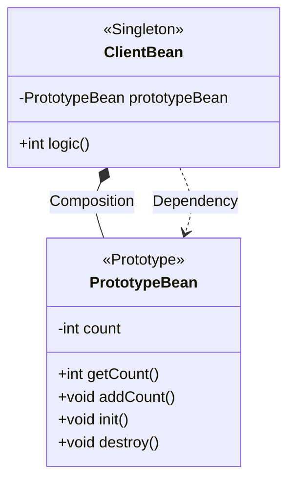

## 빈 스코프란?
스프링 빈은 스프링 컨테이너의 시작과 함께 생성되어서 스프링 컨테이너가 종료될 때 까지 유지된다고 학습했다. 이것은 스프링 빈이 기본적으로 싱글톤 스코프로 생성되기 때문이다.

스코프는 번역 그대로 빈이 존재할 수 있는 범위를 의미한다. 스프링은 다음과 같은 다양한 스코프를 지원한다.

- **싱글톤**: 기본 스코프, 스프링 컨테이너의 시작과 종료까지 유지되는 가장 넓은 범위의 스코프
- **프로토타입**: 스프링 컨테이너는 프로토타입 빈의 생성과 의존관계 주입까지만 관여하고 더는 관리하지 않는 매우 짧은 범위의 스코프
- **웹 관련 스코프**:
	- **request**: 웹 요청이 들어오고 나갈때까지 유지되는 스코프
	- **session**: 웹 세션이 생성되고 종료될 때 까지 유지되는 스코프
	- **application**: 웹의 서블릿 컨텍스트와 같은 범위로 유지되는 스코프

빈 스코프는 다음과 같이 지정할 수 있다.
### 컴포넌트 스캔을 통한 빈 자동 등록
```java
@Scope("prototype")
@Component
public class HelloBean {}
```

### @Configuration 설정 정보를 통한 빈 수동 등록
```java
@Scope("prototype)
@Bean
PrototypeBean HelloBean() {
	return new HelloBean();
}
```

지금까지는 싱글톤 스코프를 계속 사용하였으니 프로토타입 스코프부터 알아본다.

## 프로토타입 스코프
싱글톤 스코프의 빈을 조회하면 스프링 컨테이너는 항상 같은 인스턴스의 스프링 빈을 반환한다. 반면에 프로토타입 스코프를 스프링 컨테이너에 조회하면 스프링 컨테이너는 항상 새로운 인스턴스를 생성해서 반환한다.

### 싱글톤 빈 요청 과정

![[spring-basic-bean-scope-1.png]]
1. 싱글톤 스코프의 빈을 스프링 컨테이너에 요청한다.
2. 스프링 컨테이너는 본인이 관리하는 스프링 빈을 반환한다.
3. 이후에 스프링 컨테이너에 같은 요청이 와도 같은 객체 인스턴스의 스프링 빈을 반환한다.

### 프로토타입 빈 요청 과정

![[spring-basic-bean-scope-2.png]]
1. 프로토타입 스코프의 빈을 스프링 컨테이너에 요청한다
2. 스프링 컨테이너는 이 시점에 프로토타입 빈을 생성하고, 필요한 의존관계를 주입한다.

![[spring-basic-bean-scope-3.png]]
3. 스프링 컨테이너는 생성한 프로토타입 빈을 클라이언트에 반환한다.
4. 이후에 스프링 컨테이너에 같은 요청이 오면 항상 새로운 프로토타입 빈을 생성해서 반환한다.


> [!summary] 핵심
> **스프링 컨테이너는 프로토타입 빈을 생성하고, 의존관계 주입, 초기화까지만 처리한다.** 
> 클라이언트에 빈을 반환하고, 이후 스프링 컨테이너는 생성된 프로토타입 빈을 관리하지 않는다. 
> 
> 프로토타입 빈을 관리할 책임은 프로토타입을 받은 클라이언트에게 있다. 그래서 `@PreDestroy`같은 종료 메서드가 호출되지 않는다.

```java
public class PrototypeBeanTest {  
    @Test  
    void prototypeBeanFind() {  
        AnnotationConfigApplicationContext ac = new AnnotationConfigApplicationContext(PrototypeBean.class);  
  
        PrototypeBean bean1 = ac.getBean(PrototypeBean.class);  
        PrototypeBean bean2 = ac.getBean(PrototypeBean.class);  
  
        System.out.println("bean1 = " + bean1);  
        System.out.println("bean2 = " + bean2);  
  
        Assertions.assertThat(bean1).isNotSameAs(bean2);  
  
        ac.close();  
    }  
  
    @Scope("prototype")  
    static class PrototypeBean {  
        @PostConstruct  
        public void init() {  
            System.out.println("PrototypeBeanTest.init");  
        }  
  
        @PreDestroy  
        public void destroy() {  
            System.out.println("PrototypeBeanTest.destroy");  
        }  
    }
}
```
- 싱글톤 빈은 스프링 컨테이너 생성 시점에 초기화 메서드가 실행 되지만, 프로토타입 스코프의 빈은 스프링 컨테이너에서 빈을 조회할 때 생성되고 초기화 메서드도 실행 된다.
- 싱글톤 빈은 스프링 컨테이너가 관리하기 때문에 스프링 컨테이너가 종료될 때 빈의 종료 메서드가 실행되지만, 프로토타입 빈은 스프링 컨테이너가 생성과 의존관계 주입 그리고 초기화까지만 관여하고 더는 관리하지 않는다.
- 따라서 프로토타입 빈은 스프링 컨테이너가 종료될 때 `@PreDestroy`가 적용된 종료 메서드를 실행하지 않는다.


> [!note] 프로토타입 빈의 특징
> - 스프링 컨테이너에 요청할 때 마다 새로 생성된다.
> - 스프링 컨테이너는 프로토타입 빈의 생성과 의존관계 주입, 그리고 초기화까지만 관여한다.
> - 종료 메서드가 호출되지 않는다.
> - 그래서 프로토타입 빈을 조회한 클라이언트가 관리해야 한다. 종료 메서드에 대한 호출도 클라이언트가 직접 해야한다.

## 프로토타입 스코프 - 싱글톤 빈과 함께 사용시 문제점
스프링 컨테이너에 프로타입 스코프의 빈을 요청하면 항상 새로운 객체 인스턴스를 생성해서 반환한다.
하지만 싱글톤 빈과 함께 사용할 때는 의도한 대로 잘 동작하지 않으므로 주의해야 한다.

```java
public class SingletonWithPrototypeTest1 {  
    @Test  
    void prototypeFind() {  
        AnnotationConfigApplicationContext ac = new AnnotationConfigApplicationContext(PrototypeBean.class);  
        PrototypeBean bean1 = ac.getBean(PrototypeBean.class);  
        bean1.addCount();  
        assertThat(bean1.getCount()).isEqualTo(1);  
  
        PrototypeBean bean2 = ac.getBean(PrototypeBean.class);  
        bean2.addCount();  
        assertThat(bean2.getCount()).isEqualTo(1);  
    }  
  
    @Test  
    void singletonClientUsePrototype() {  
        AnnotationConfigApplicationContext ac = new AnnotationConfigApplicationContext(ClientBean.class,  
                PrototypeBean.class);  
        ClientBean clientBean1 = ac.getBean(ClientBean.class);  
        ClientBean clientBean2 = ac.getBean(ClientBean.class);  
  
        int count1 = clientBean1.logic();  
        assertThat(count1).isEqualTo(1);  
  
        int count2 = clientBean2.logic();  
        assertThat(count2).isEqualTo(2);  
    }  
  
    @Scope("singleton")  
    @RequiredArgsConstructor  
    static class ClientBean {  
        private final PrototypeBean prototypeBean;  
  
        public int logic() {  
            prototypeBean.addCount();  
            return prototypeBean.getCount();  
        }  
    }  
  
    @Scope("prototype")  
    static class PrototypeBean {  
        private int count;  
  
        public void addCount() {  
            count++;  
        }  
  
        public int getCount() {  
            return count;  
        }  
  
        @PostConstruct  
        public void init() {  
            System.out.println("PrototypeBean.init = " + this);  
        }  
  
        @PreDestroy  
        public void destroy() {  
            System.out.println("PrototypeBean.destroy");  
        }  
    }  
}
```

실습을 위해 먼저 테스트 코드를 작성한다. 위 코드의 구조는 아래와 같다.


이 코드는 개발자의 의도와 다르게 작동할 수 있는데, 이유는 스코프의 차이로 인해 발생한다. 코드를 살펴보면 `ClientBean`은 싱글톤 스코프를 가지는 객체이고, `PrototypeBean`은 프로토타입 스코프를 가지는 객체이다.

스프링 컨테이너가 시작과 동시에 객체를 생성하고, 의존관계를 주입한다. 이 떄 `ClientBean`의 의존관계인 `PrototypeBean`이 주입된다.

스프링 컨테이너는 프로토타입 스코프를 가지는 객체에 대해 객체 생성, 의존관계 주입, 초기화까지만 관여한다. 따라서 `ClientBean`에 주입된 `PrototypeBean`은 이제 스프링 컨테이너의 관리 영역에서 벗어난 것이다.

어쨌든 `ClientBean`은 싱글톤 스코프를 가지므로, 스프링 컨테이너가 종료될 때 까지 유지된다. 따라서 한번 주입 된 **`PrototypeBean`은 의도와 다르게 매번 새로운 객체를 생성하지 않고, 같은 객체를 사용하게 된다.** 쉽게 이야기 해서 싱글톤 빈이 프로토타입 빈을 사용하게 된다. 그런데 싱글톤 빈은 생성 시점에만 의존관계 주입을 받기 때문에, 프로토타입 빈이 새로 생성되기는 하지만, 싱글톤 빈과 함께 계속 유지되는 것이 문제다.

이럴거면 싱글톤 빈을 쓰지, 왜 프로토타입 빈으로 사용하겠는가?

개발자의 의도가 `ClientBean.logic()`을 호출할 때마다 새로운 `PrototypeBean` 인스턴스를 사용하는 것이라면 어떻게 구현해야 할까?

## 프로토타입 스코프 - 싱글톤 빈과 함께 사용시 Provider로 문제 해결

싱글톤 빈과 프로토타입 빈을 함께 사용할 때, 어떻게 하면 사용할 때 마다 새로운 프로토타입 빈을 생성할 수 있을까?

### 스프링 컨테이너에 요청
가장 간단한 방법은 싱글톤 빈이 프로토타입을 사용할 때 마다 스프링 컨테이너에 새로 요청하는 것이다.

```java
static class ClientBean {
	@Autowired private ApplicationContext ac;

	public int logic() {
		PrototypeBean prototypeBean = ac.getBean(PrototypeBean.class);
		prototypeBean.addCount();

		return prototypeBean.getCount();
	}
}

```

- `ApplicationContext`를 통해서 `getBean()`시 항상 새로운 프로토타입 빈이 생성된다.
- 그런데 이렇게 스프링 어플리케이션 컨텍스트 전체를 주입받게 되면, 스프링 컨테이너에 종속적인 코드가 되고, 단위 테스트도 어려워진다.
- 의존관계를 외부에서 주입 받는게 아니라 이렇게 직접 필요한 의존관계를 찾는 것을 Dependency Lookup(DL), 의존관계 조회(탐색)이라한다.
- 지금 필요한 기능은 프로토타입 빈을 컨테이너에서 대신 찾아주는, 정확히 **DL** 정도의 기능만 제공하는 무언가다.

스프링에는 이미 모든게 준비되어 있다.

### ObjectFactory, ObjectProvider
지정한 빈을 컨테이너에서 대신 찾아주는 DL 서비스를 제공하는 것이 바로 `ObjectProvider`이다. 참고로 과거에는 `ObjectFactory`가 있었는데, 여기에 편의 기능을 추가해서 `ObjectProvider`가 만들어졌다.


---
References: 김영한의 스프링 핵심 원리 - 기본편

Links to this page: 