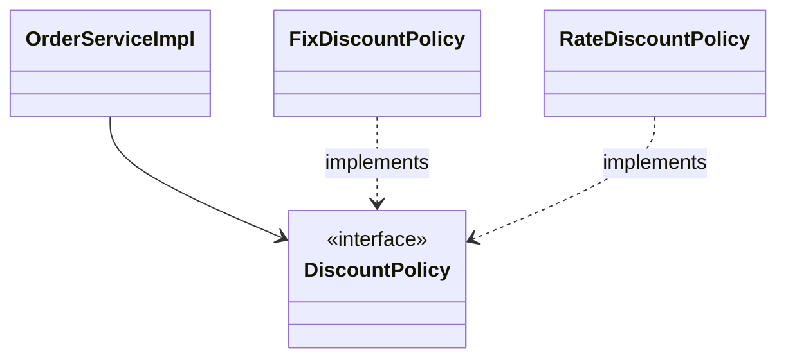
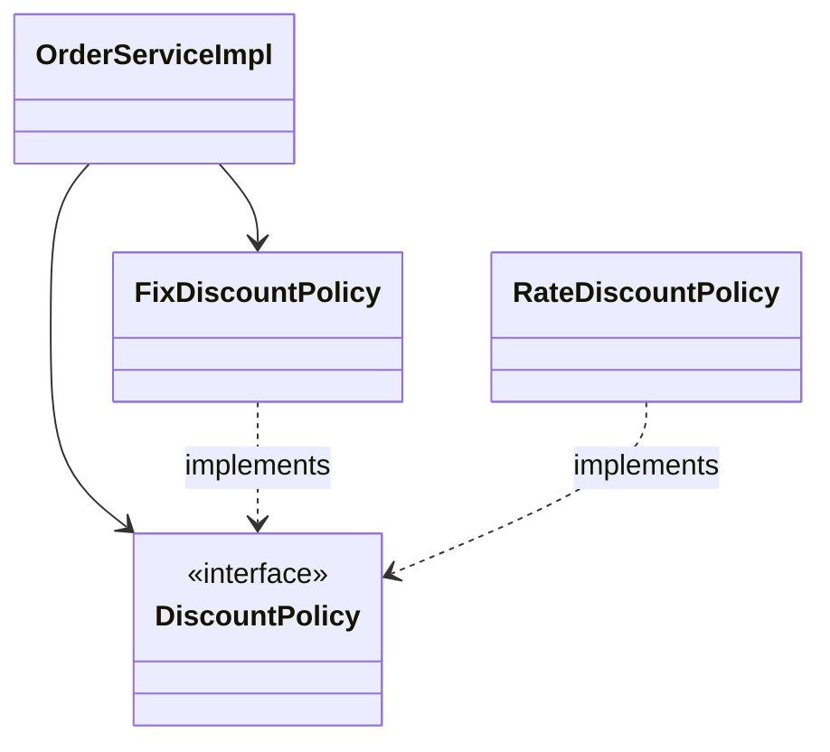

## 비즈니스 요구사항과 설계
- 회원
	- 회원을 가입하고 조회할 수 있다.
	- 회원은 일반과 VIP 두 가지 등급이 있다.
	- 회원 데이터는 자체 DB를 구축할 수 있고, 외부 시스템과 연동할 수 있다. (미확정)
- 주문과 할인 정책
	- 회원은 상품을 주문할 수 있다.
	- 회원 등급에 따라 할인 정책을 적용할 수 있다.
	- 할인 정책은 모든 VIP는 1000원을 할인해주는 고정 금액 할인을 적용해달라. (나중에 변경 가능)
	- 할인 정책은 변경 가능성이 높다. 회사의 기본 할인 정책을 아직 정하지 못했고, 오픈 직전까지 고민을 미루고 싶다. 최악의 경우 할인을 적용하지 않을 수도 있다. (미확정)

요구사항을 살펴보면 회원 데이터, 할인 정책 같은 부분은 지금 당장 결정하기 어려운 부분이다. 그렇다고 정책이 결정 될 때까지 개발을 무기한 기다릴 수도 없다.

앞서 학습했던 [[Resources/프로그래밍/Java/0. 기본/다형성|다형성]]을 활용하여 객체 지향 설계 방법으로 개발한다. 먼저 스프링 없는 순수한 자바로만 개발을 진행한다.

## 회원 도메인 설계
- 회원을 가입하고 조회할 수 있다.
- 회원은 일반과 VIP 두 가지 등급이 있다.
- 회원 데이터는 자체 DB를 구축할 수도 있고, 외부 시스템과 연동할 수 있다. (미확정)

![[spring-basic-예제만들기-1.png]]

![[spring-basic-예제만들기-2.png]]

![[spring-basic-예제만들기3.png]]

- **도메인 협력 관계 다이어그램**: 회원 도메인간 협력 관계를 나타낸다. 역할과 구현을 나눈 것이다.
- **클래스 다이어그램**: 협력 관계 다이어그램을 바탕으로 클래스 간의 관계를 구체화해서 나타낸다.
- **객체 다이어그램**: 객체, 실제 메모리간의 참조가 어떻게 되는지를 나타낸다. 회원 서비스는 정확히 `MemberServiceImpl` 객체다.

## 회원 도메인
회원 도메인과 관련된 구현은 완료되었다. 테스트를 할 차례다.

### 회원 서비스 구현체
```java
public class MemberServiceImpl implements MemberService {  
    private final MemberReository memberRepository = new MemoryMemberRepository();  
  
    @Override  
    public void join(Member member) {  
        memberRepository.save(member);  
    }  
  
    @Override  
    public Member findMember(Long memberId) {  
        return memberRepository.findById(memberId);  
    }  
}
```

### 회원 가입 테스트
```java
import org.assertj.core.api.Assertions;  
import org.junit.jupiter.api.Test;  
  
public class MemberServiceTest {  
    MemberService memberService = new MemberServiceImpl();  
  
    @Test  
    void join() {  
        // Given  
        Member member1 = new Member(1L, "member1", Grade.VIP);  
        // When  
        memberService.join(member1);  
        Member find = memberService.findMember(member1.getId());  
        // Then  
        Assertions.assertThat(member1).isEqualTo(find);  
    }  
}
```

> [!question] 회원 도메인 설계의 문제점
> 이 코드의 설계상 문제점은 무엇일까?
> 다른 저장소로 변경할 때 OCP 원칙을 잘 준수할까? DIP를 잘 지키고 있을까?
> 
> **의존관계가 인터페이스 뿐만 아니라 구현까지 모두 의존하는 문제점이 있다.** 
> 
> 현재는 인터페이스에 의존하는 필드에 직접 구현체를 생성한다. 그리고 생성자를 통해 주입한다고 하여도 코드를 변경해야 한다. DIP를 위반하고 있다.
> 
> 이 문제는 주문 도메인까지 만들고나서 문제점과 해결 방안을 찾아본다.


## 주문과 할인 도메인 설계
- 주문과 할인 정책
	- 회원은 상품을 주문할 수 있다.
	- 회원 등급에 따라 할인 정책을 적용할 수 있다.
	- 할인 정책은 모든 VIP는 1000원을 할인해주는 고정 금액 할인을 적용해달라. (나중에 변경 가능)
	- 할인 정책은 변경 가능성이 높다. 회사의 기본 할인 정책을 아직 정하지 못했고, 오픈 직전까지 고민을 미루고 싶다. 최악의 경우 할인을 적용하지 않을 수도 있다. (미확정)

![[spring-basic-예제만들기-3.png]]

1. 주문 생성: 클라이언트는 주문 서비스에 주문 생성을 요청한다.
2. 회원 조회: 할인을 위해서는 회원 등급이 필요하다. 회원 저장소에서 회원을 조회한다.
3. 할인 적용: 주문 서비스는 회원 등급에 따른 할인 여부를 할인 정책에 위임한다.
4. 주문 결과 반환: 주문 서비스는 할인 결과를 포함한 주문 결과를 반환한다.

> 실제로는 주문 데이터를 DB에 저장하겠지만, 예제의 단순함을 위해 주문의 결과를 반환한다.

![[spring-basic-예제만들기-4.png]]

**역할과 구현**을 분리해서 자유롭게 구현 객체를 조립할 수 있게 설계했다. 덕분에 회원 저장소는 물론이고, 할인 정책도 유연하게 변경할 수 있다.

![[spring-basic-예제만들기-5.png]]

좋은 객체 지향 설계 덕분에 회원을 메모리에 저장하거나, DB에 저장한다해도 주문 서비스에 대해서 변경하지 않아도 된다. 협력 관계를 그대로 재사용 할 수 있다.

실제 구현 코드는 너무 길어지므로 문서에 업로드하지 않는다.

## 객체 지향 원리 적용
서비스 오픈 직전에 할인 정책을 현재 존재하는 `FixDiscountPolicy`(정액 할인제)가 아닌 `RateDiscountPolicy`(정률 할인제)로 변경하게 되는 시나리오를 가정한다.

핵심은 객체지향 설계 원칙을 잘 준수했는지 확인하는 것이다.

### 새로운 할인 정책 구현
먼저 정액 할인제가 아닌 정률 할인제 클래스를 구현한다.

```java title="RateDiscountPolicy.java"
import hello.core.member.Grade;  
import hello.core.member.Member;  
  
public class RateDiscountPolicy implements DiscountPolicy {  
    private int discountPercent = 10;  
  
    @Override  
    public int discount(Member member, int price) {  
        if (member.getGrade() == Grade.VIP) {  
            return price * discountPercent / 100;  
        } else {  
            return 0;  
        }  
    }  
}
```

구현은 끝났으므로, 테스트 코드를 작성한다. 

인텔리제이에서 메서드 이름에 포인터를 두고 `CMD+SHIFT+T`를 하면 테스트를 자동으로 생성해준다.

```java title="RateDiscountPolicyTest.java"
import hello.core.member.Grade;  
import hello.core.member.Member;  
import org.assertj.core.api.Assertions;  
import org.junit.jupiter.api.DisplayName;  
import org.junit.jupiter.api.Test;  
  
class RateDiscountPolicyTest {  
    RateDiscountPolicy discountPolicy = new RateDiscountPolicy();  
  
    @Test  
    @DisplayName("VIP는 10% 할인이 적용되어야 한다.")  
    void vip_o() {  
        // Given  
        Member member = new Member(1L, "memberVIP", Grade.VIP);  
  
        // When  
        int discount = discountPolicy.discount(member, 10000);  
  
        // Then  
        Assertions.assertThat(discount).isEqualTo(1000);  
    }  
  
}
```
- `@DisplayName()`: 이 어노테이션은 테스트 시 출력되는 이름을 변경해준다. 아주 유용한 어노테이션이다.

테스트에서 성공하는 테스트도 물론 중요하지만, 실패하는 테스트도 중요하다. 따라서 VIP가 아니면 할인이 적용되지 않는지도 테스트한다.

```java
@Test  
@DisplayName("VIP가 아니면 할인이 적용되지 않아야 한다.")  
void vip_x() {  
    // Given  
    Member member = new Member(1L, "memberBASIC", Grade.BASIC);  
  
    // When  
    int discount = discountPolicy.discount(member, 10000);  
  
    // Then  
    Assertions.assertThat(discount).isEqualTo(0);  
}
```

![[spring-basic-테스트-1.png]]

개발 하다가 종종 개발이 끝난 기능인데, 불안할 때가 있다. 이런 경우는 항상 테스트를 잘 활용해야 한다.

### 새로운 할인 정책 적용과 문제점

```java
public class OrderServiceImpl implements OrderService {  
    private final MemberReository memberReository = new MemoryMemberRepository();  
//    private final DiscountPolicy discountPolicy = new FixDiscountPolicy();  
    private final DiscountPolicy discountPolicy = new RateDiscountPolicy();
```

할인 정책을 변경하려면 위 처럼 클라이언트 코드인 `OrderServiceImpl`의 코드를 변경해야 한다.

**문제점**
- 우리는 역할과 구현을 충실하게 분리했다. -> OK
- 다형성도 활용하고, 인터페이스와 구현 객체를 분리했다. -> OK
- OCP, DIP 같은 객체지향 설계 원칙을 충실히 준수했다.
	- -> 그렇게 보이지만 사실은 아니다.
- DIP: 주문서비스 클라이언트인 `OrderServiceImpl`는 `DiscountPolicy` 인터페이스에 의존하면서 DIP를 지킨 것 같은데?
	- -> 클래스 의존관계를 분석해보자. 추상(인터페이스) 뿐만 아니라 구체(구현) 클래스에도 의존하고 있다.
- OCP: 변경하지 않고 확장할 수 있다고 했는데?
	- -> 지금 코드는 기능을 확장해서 변경하면, 클라이언트 코드에 영향을 준다. 따라서 OCP 위반이다.

#### 왜 클라이언트 코드를 변경해야 할까?

기대 했던 의존관계 다이어그램은 다음과 같다.



실제 의존관계는 다음과 같다.

클라이언트인 `OrderServiceImpl`이 인터페이스인 `DiscountPolicy` 뿐만 아니라 그 구현인 `FixDiscountPolicy`도 의존하고 있다. **DIP**를 위반한 것이다.

```java
public class OrderServiceImpl implements OrderService {  
    private final DiscountPolicy discountPolicy = new RateDiscountPolicy();
```


---
References: 김영한의 스프링 핵심 원리 - 기본편

Links to this page: [[Resources/프로그래밍/Java/0. 기본/다형성|다형성]]
