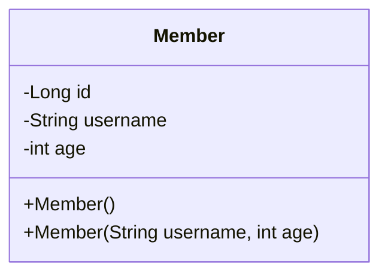

## 회원 관리 웹 어플리케이션
회원 관리 웹 어플리케이션을 만들어보면서 서블릿, JSP, MVC에 대해 학습한다.



**기능 요구사항**
- 회원 저장
- 회원 목록 조회

요구사항에 맞춰서 `MemberRepository`를 구현한다. 그리고 이 레포지토리는 싱글톤 패턴을 적용한다.

```java
public class MemberRepository {  
    private static Map<Long, Member> store = new HashMap<>();  
    private static Long sequence = 0L;  
  
    @Getter  
    private static final MemberRepository instance = new MemberRepository();  
  
    private MemberRepository() {}  
  
    public Member save(Member member) {  
        member.setId(++sequence);  
        store.put(member.getId(), member);  
  
        return member;  
    }  
  
    public Member findById(Long id) {  
        return store.get(id);  
    }  
  
    public List<Member> findAll() {  
        return new ArrayList<>(store.values());  
    }  
  
    public void clear() {  
        store.clear();  
    }  
}
```


---
References: 김영한의 스프링 MVC 1편

Links to this page: 