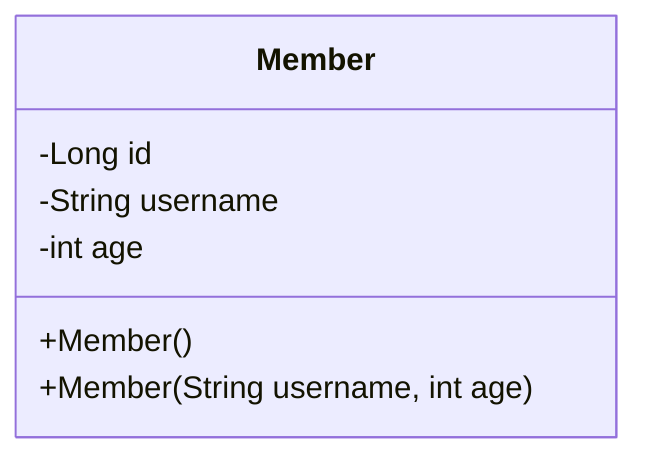

## 회원 관리 웹 어플리케이션
회원 관리 웹 어플리케이션을 만들어보면서 서블릿, JSP, MVC에 대해 학습한다.



**기능 요구사항**
- 회원 저장
- 회원 목록 조회

요구사항에 맞춰서 `MemberRepository`를 구현한다. 그리고 이 레포지토리는 싱글톤 패턴을 적용한다.

```java
public class MemberRepository {  
    private static Map<Long, Member> store = new HashMap<>();  
    private static Long sequence = 0L;  
  
    @Getter  
    private static final MemberRepository instance = new MemberRepository();  
  
    private MemberRepository() {}  
  
    public Member save(Member member) {  
        member.setId(++sequence);  
        store.put(member.getId(), member);  
  
        return member;  
    }  
  
    public Member findById(Long id) {  
        return store.get(id);  
    }  
  
    public List<Member> findAll() {  
        return new ArrayList<>(store.values());  
    }  
  
    public void clear() {  
        store.clear();  
    }  
}
```

테스트 코드도 간단히 작성한다.

```java
class MemberRepositoryTest {  
    MemberRepository memberRepository = MemberRepository.getInstance();  
  
    @AfterEach  
    void afterEach() {  
        memberRepository.clear();  
    }  
  
    @Test  
    void save() {  
        // given  
        Member member = new Member("hello", 20);  
  
        // when  
        Member savedMember = memberRepository.save(member);  
  
        // then  
        Member findMember = memberRepository.findById(savedMember.getId());  
        assertThat(savedMember).isSameAs(findMember);  
    }  
  
    @Test  
    void findAll() {  
        // given  
        Member member1 = new Member("member1", 20);  
        Member member2 = new Member("member2", 30);  
        memberRepository.save(member1);  
        memberRepository.save(member2);  
        // when  
        List<Member> all = memberRepository.findAll();  
  
        // then  
        assertThat(all.size()).isEqualTo(2);  
    }  
}
```


## 서블릿으로 회원 관리 웹 어플리케이션 개발
가장 먼저 서블릿을 활용해서 회원 관리 웹 어플리케이션을 개발해본다.

```java
@WebServlet(name = "memberFormServlet", urlPatterns = "/servlet/members/new-form")  
public class MemberFormServlet extends HttpServlet {  
    private MemberRepository memberRepository = MemberRepository.getInstance();  
  
    @Override  
    protected void service(HttpServletRequest req, HttpServletResponse res) throws ServletException, IOException {  
        res.setContentType("text/html");  
        res.setCharacterEncoding("utf-8");  
  
        PrintWriter w = res.getWriter();  
        w.write("<!DOCTYPE html>\n" +  
                "<html>\n" +  
                "<head>\n" +  
                " <meta charset=\"UTF-8\">\n" +  
                " <title>Title</title>\n" +  
                "</head>\n" +  
                "<body>\n" +  
                "<form action=\"/servlet/members/save\" method=\"post\">\n" +  
                " username: <input type=\"text\" name=\"username\" />\n" +  
                " age: <input type=\"text\" name=\"age\" />\n" +  
                " <button type=\"submit\">전송</button>\n" +  
                "</form>\n" +  
                "</body>\n" +  
                "</html>\n");  
    }  
}
```
폼 하나를 만들어서 전송하는데도 정말 힘들다. 

실제로 전 직장에서 이런 작업 비슷한걸 했었는데 정말 힘든 작업이다. 서버 사이드 렌더링이기 때문에 틀리면 재시작 해야 하는데 `"`를 잘못 작성한다던지, HTML 태그를 이상하게 작성했다던지.. 아무튼 귀찮고 짜증나는 작업이다.

---
References: 김영한의 스프링 MVC 1편

Links to this page: 