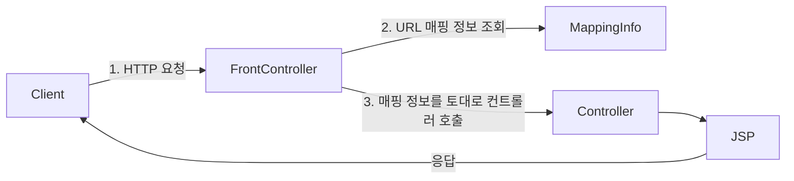
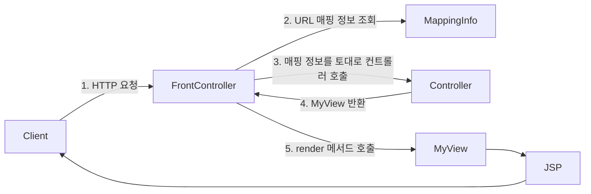

## 프론트 컨트롤러 패턴
프론트 컨트롤러 패턴을 학습하고, 프론트 컨트롤러를 기반으로 단계별로 MVC 프레임워크를 직접 구현해본다.

![[spring-basic-front-contoller-1.png]]

![[spring-basic-front-controller-2.png]]

프론트 컨트롤러 패턴을 도입하기 전에는 다수의 서블릿 객체에 중복되는 코드가 많았다. 그런데 공통적인 부분들을 로직화해서 따로 빼는 것에도 문제가 있었다. 중복되는 코드를 공통 로직으로 뺸다고 해도 어짜피 작성하는 코드는 또 다시 중복되기 때문이다.

프론트 컨트롤러 패턴을 도입하면, 공통되는 로직등을 한 곳에서 모두 처리하고 비즈니스 로직은 따로 처리할 수 있게 된다. 스프링 MVC도 이와 같은 구조를 가지고 있다.

**프론트 컨트롤러 패턴 특징**
- 프론트 컨트롤러 서블릿 하나로 클라이언트의 요청을 받음
- 프론트 컨트롤러가 요청에 맞는 컨트롤러를 찾아서 호출
- 입구를 하나로 만든다.
- 따라서 공통 처리가 가능해짐
- 프론트 컨트롤러를 제외한 나머지 컨트롤러는 서블릿을 사용하지 않아도 됨

**스프링 웹 MVC와 프론트 컨트롤러**

스프링 웹 MVC의 핵심은 바로 프론트 컨트롤러다. 스프링 웹 MVC의 `DispatcherServlet`이 프론트 컨트롤러 패턴으로 구현되어 있다.

## 프론트 컨트롤러 도입
이번 목표는 기존 코드를 최대한 유지하면서, 프론트 컨트롤러를 도입하는 것이다. 

먼저 다음과 같은 구조를 맞추어두고 점진적으로 리팩터링한다.




- `MappingInfo`는 HTTP 요청이 어떤 URL에 요청했는지와 해당 URL에 매핑된 컨트롤러가 어떤 컨트롤러인지의 정보를 갖고있다.


### ControllerV1 - 구조 개선
```java
public interface ControllerV1 {  
    void process(HttpServletRequest request, HttpServletResponse response) throws ServletException, IOException;  
}
```

서블릿과 비슷한 모양의 컨트롤러 인터페이스를 도입한다. 각 컨트롤러들은 이 인터페이스를 구현하면 된다. 프론트 컨트롤러는 이 인터페이스를 호출해서 구현과 관계없이 로직의 일관성을 가져갈 수 있다.

```java
public class MemberFormControllerV1 implements ControllerV1 {  
    @Override  
    public void process(HttpServletRequest request, HttpServletResponse response) throws ServletException, IOException {  
        String viewPath = "/WEB-INF/views/new-form.jsp";  
        RequestDispatcher dispatcher = request.getRequestDispatcher(viewPath);  
        dispatcher.forward(request, response);  
    }  
}
```


```java
public class MemberSaveControllerV1 implements ControllerV1 {  
    private MemberRepository memberRepository = MemberRepository.getInstance();  
  
    @Override  
    public void process(HttpServletRequest request, HttpServletResponse response) throws ServletException, IOException {  
        String username = request.getParameter("username");  
        int age = Integer.parseInt(request.getParameter("age"));  
  
        Member member = new Member(username, age);  
        memberRepository.save(member);  
  
        request.setAttribute("member", member);  
  
        String viewPath = "/WEB-INF/views/save.jsp";  
        RequestDispatcher dispatcher = request.getRequestDispatcher(viewPath);  
        dispatcher.forward(request, response);  
    }  
}
```

```java
public class MemberListControllerV1 implements ControllerV1 {  
    private MemberRepository memberRepository = MemberRepository.getInstance();  
  
    @Override  
    public void process(HttpServletRequest request, HttpServletResponse response) throws ServletException, IOException {  
        List<Member> members = memberRepository.findAll();  
  
        request.setAttribute("members", members);  
  
        String viewPath = "/WEB-INF/views/members.jsp";  
        RequestDispatcher dispatcher = request.getRequestDispatcher(viewPath);  
        dispatcher.forward(request, response);  
    }  
}
```

이제 모든 컨트롤러를 구현했다. 마지막으로 프론트 컨트롤러를 구현할 차례다.

```java
@WebServlet(name = "frontControllerServletV1", urlPatterns = "/front-controller/v1/*")  
public class FrontControllerServletV1 extends HttpServlet {  
    private Map<String, ControllerV1> controllerMap = new HashMap<>();  
  
    public FrontControllerServletV1() {  
        controllerMap.put("/front-controller/v1/members/new-form", new MemberFormControllerV1());  
        controllerMap.put("/front-controller/v1/members/save", new MemberSaveControllerV1());  
        controllerMap.put("/front-controller/v1/members", new MemberListControllerV1());  
    }  
  
    @Override  
    protected void service(HttpServletRequest request, HttpServletResponse response) throws ServletException, IOException {  
        String requestURI = request.getRequestURI();  
  
        ControllerV1 controller = controllerMap.get(requestURI);  
  
        if (controller == null) {  
            response.setStatus(HttpServletResponse.SC_NOT_FOUND);  
            return;  
        }  
  
        controller.process(request, response);  
    }  
}
```

- 프론트 컨트롤러는 와일드카드 `*`를 `urlPattern`으로 사용하여 `/front-controller/v1`를 포함한 모든 하위 요청이 이 서블릿을 통하도록 한다.
- 프론트 컨트롤러 서블릿 객체는 내부에 맵 구조의 `controllerMap`을 가진다.
- 생성시 `controllerMap`에 URL 매핑 정보를 키로하는 컨트롤러 객체를 담는다.
- 요청 URI를 가져와 `controllerMap`의 키로 사용하여 컨트롤러를 찾고, 다형성을 이용하여 각 컨트롤러가 구현한 `process()` 메서드를 호출한다.

### ControllerV2 - 뷰 분리
모든 컨트롤러에서 뷰로 이동하는 부분에 중복이 있고, 깔끔하지 않다.
```java
String viewPath = "/WEB-INF/views/save.jsp";  
RequestDispatcher dispatcher = request.getRequestDispatcher(viewPath);  
dispatcher.forward(request, response);
```

이 부분을 깔끔하게 분리하기 위해 다음과 같은 구조의 별도로 뷰를 처리하는 객체를 만든다.




```java
public class MyView {  
    private String viewPath;  
  
    public MyView(String viewPath) {  
        this.viewPath = viewPath;  
    }  
  
    public void render(HttpServletRequest request, HttpServletResponse response) throws ServletException, IOException {  
        RequestDispatcher dispatcher = request.getRequestDispatcher(viewPath);  
        dispatcher.forward(request, response);  
    }  
}
```

```java
public interface ControllerV2 {  
    MyView process(HttpServletRequest request, HttpServletResponse response) throws ServletException, IOException;  
}
```

```java
public class MemberFormControllerV2 implements ControllerV2 {  
    @Override  
    public MyView process(HttpServletRequest request, HttpServletResponse response)  
            throws ServletException, IOException {  
        return new MyView("/WEB-INF/views/new-form.jsp");  
    }  
}
```

```java
public class MemberListControllerV2 implements ControllerV2 {  
    private MemberRepository memberRepository = MemberRepository.getInstance();  
  
    @Override  
    public MyView process(HttpServletRequest request, HttpServletResponse response) throws ServletException, IOException {  
        List<Member> members = memberRepository.findAll();  
        request.setAttribute("members", members);  
  
        return new MyView("/WEB-INF/views/members.jsp");  
    }  
}
```

```java
public class MemberSaveControllerV2 implements ControllerV2 {  
    private MemberRepository memberRepository = MemberRepository.getInstance();  
  
    @Override  
    public MyView process(HttpServletRequest request, HttpServletResponse response)  
            throws ServletException, IOException {  
        String username = request.getParameter("username");  
        int age = Integer.parseInt(request.getParameter("age"));  
  
        Member member = new Member(username, age);  
        memberRepository.save(member);  
  
        request.setAttribute("member", member);  
  
  
        return new MyView("/WEB-INF/views/save.jsp");  
    }  
}
```

```java
@WebServlet(name = "frontControllerServletV2", urlPatterns = "/front-controller/v2/*")  
public class FrontControllerServletV2 extends HttpServlet {  
    private Map<String, ControllerV2> controllerMap = new HashMap<>();  
  
    public FrontControllerServletV2() {  
        controllerMap.put("/front-controller/v2/members/new-form", new MemberFormControllerV2());  
        controllerMap.put("/front-controller/v2/members/save", new MemberSaveControllerV2());  
        controllerMap.put("/front-controller/v2/members", new MemberListControllerV2());  
    }  
  
    @Override  
    protected void service(HttpServletRequest request, HttpServletResponse response) throws ServletException, IOException {  
        String requestURI = request.getRequestURI();  
  
        ControllerV2 controller = controllerMap.get(requestURI);  
  
        if (controller == null) {  
            response.setStatus(HttpServletResponse.SC_NOT_FOUND);  
            return;  
        }  
  
        MyView view = controller.process(request, response);  
        view.render(request, response);  
    }  
}
```

이제 각 컨트롤러는 복잡한 `dispatch.forward()`를 직접 호출하지 않아도 된다. 단순히 `MyView` 객체를 생성하고 거기에 뷰 경로만 넣고 반환하면 된다.

`ControllerV2.process()`의 반환 타입이 `MyView`이므로 프론트 컨트롤러는 호출 결과로 `MyView` 객체를 반환 받는다. 그리고 해당 

---
References: 김영한의 스프링 MVC 1편

Links to this page: 