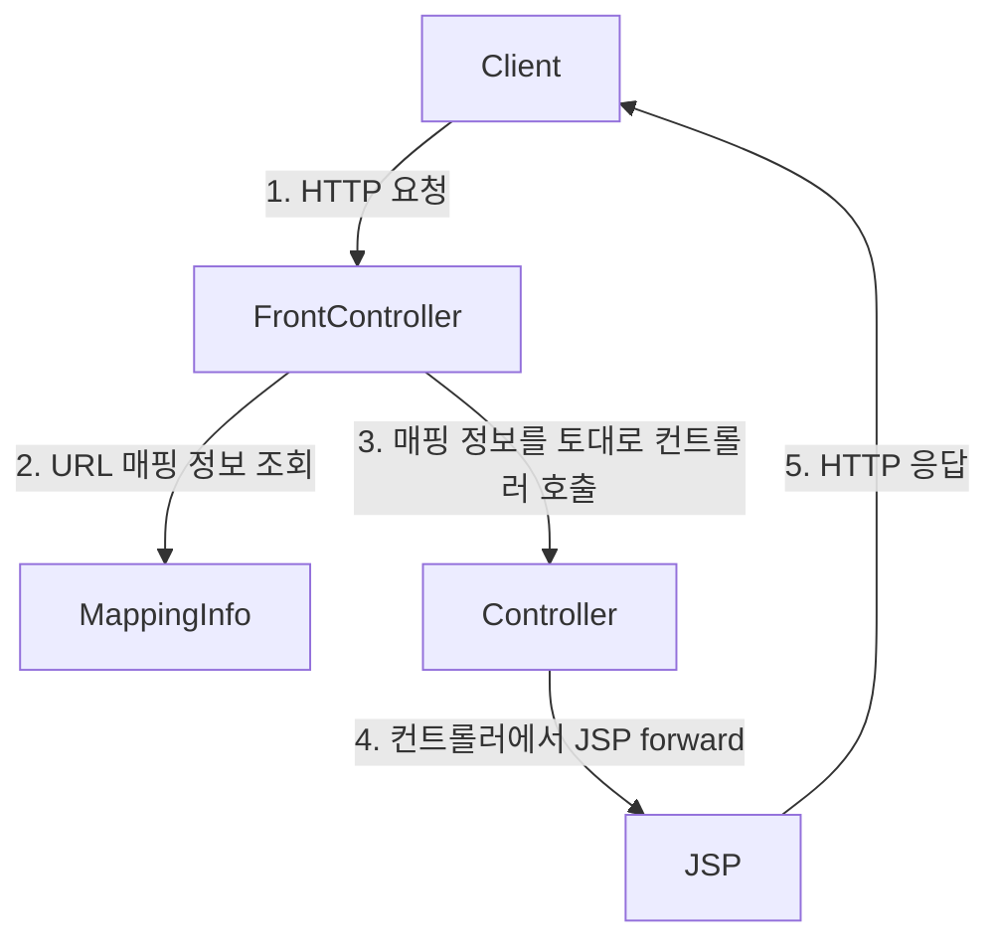

## 프론트 컨트롤러 패턴
프론트 컨트롤러 패턴을 학습하고, 프론트 컨트롤러를 기반으로 단계별로 MVC 프레임워크를 직접 구현해본다.

![[spring-basic-front-contoller-1.png]]

![[spring-basic-front-controller-2.png]]

프론트 컨트롤러 패턴을 도입하기 전에는 다수의 서블릿 객체에 중복되는 코드가 많았다. 그런데 공통적인 부분들을 로직화해서 따로 빼는 것에도 문제가 있었다. 중복되는 코드를 공통 로직으로 뺸다고 해도 어짜피 작성하는 코드는 또 다시 중복되기 때문이다.

프론트 컨트롤러 패턴을 도입하면, 공통되는 로직등을 한 곳에서 모두 처리하고 비즈니스 로직은 따로 처리할 수 있게 된다. 스프링 MVC도 이와 같은 구조를 가지고 있다.

**프론트 컨트롤러 패턴 특징**
- 프론트 컨트롤러 서블릿 하나로 클라이언트의 요청을 받음
- 프론트 컨트롤러가 요청에 맞는 컨트롤러를 찾아서 호출
- 입구를 하나로 만든다.
- 따라서 공통 처리가 가능해짐
- 프론트 컨트롤러를 제외한 나머지 컨트롤러는 서블릿을 사용하지 않아도 됨

**스프링 웹 MVC와 프론트 컨트롤러**

스프링 웹 MVC의 핵심은 바로 프론트 컨트롤러다. 스프링 웹 MVC의 `DispatcherServlet`이 프론트 컨트롤러 패턴으로 구현되어 있다.

## 프론트 컨트롤러 도입 v1
이번 목표는 기존 코드를 최대한 유지하면서, 프론트 컨트롤러를 도입하는 것이다. 

먼저 다음과 같은 구조를 맞추어두고 점진적으로 리팩터링한다.




- `MappingInfo`는 HTTP 요청이 어떤 URL에 요청했는지와 해당 URL에 매핑된 컨트롤러가 어떤 컨트롤러인지의 정보를 갖고있다.

```java
public interface ControllerV1 {  
    void process(HttpServletRequest request, HttpServletResponse response) throws ServletException, IOException;  
}
```

서블릿과 비슷한 모양의 컨트롤러 인터페이스를 도입한다. 각 컨트롤러들은 이 인터페이스를 구현하면 된다. 프론트 컨트롤러는 이 인터페이스를 호출해서 구현과 관계없이 로직의 일관성을 가져갈 수 있다.

이제 이 인터페이스를 구현하는 컨트롤러를 만든다.

---
References: 김영한의 스프링 MVC 1편

Links to this page: 