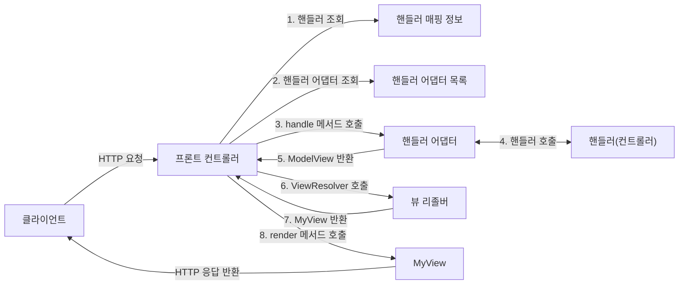

앞서 직접 만든 MVC 프레임워크와 스프링 MVC의 구조를 비교해보자.

```mermaid
flowchart LR
클라이언트
A["핸들러 매핑 정보"]
B["핸들러 어댑터 목록"]
C["프론트 컨트롤러"]
D["핸들러 어댑터"]
컨트롤러["핸들러(컨트롤러)"]
F["뷰 리졸버"]
G["MyView"]

클라이언트 -->|HTTP 요청| C
C -->|1. 핸들러 조회| A
C --> |2. 핸들러 어댑터 조회| B
C --> |3. handle 메서드 호출| D
D <--> |4. 핸들러 호출| 컨트롤러
D --> |5. ModelView 반환| C
C -->|6. ViewResolver 호출| F
F -->|7. MyView 반환| C
C -->|8. render 메서드 호출| G
G -->|HTTP 응답 반환| 클라이언트


```

---
References: 김영한의 스프링 MVC 1편

Links to this page: 