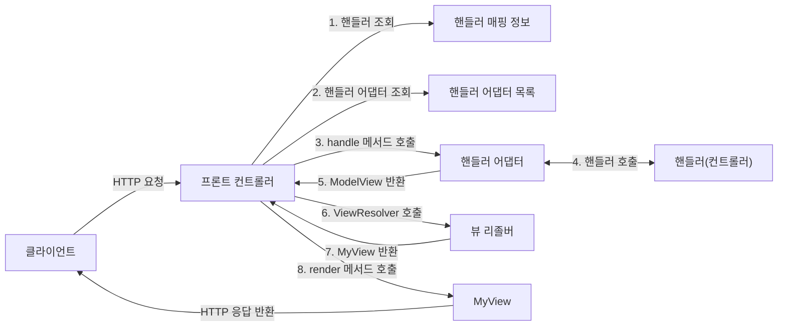
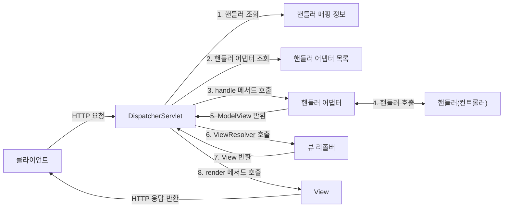

## 직접 만든 프레임워크와 스프링 MVC 구조 비교

앞서 직접 만든 MVC 프레임워크와 스프링 MVC의 구조를 비교해보자.

도표를 보면 이름이 달라졌을 뿐이지, 구조는 완전히 동일하다는 것을 알 수 있다.

**직접 만든 MVC 프레임워크 -> 스프링 MVC 비교**
- FrontController -> DispatcherServlet
- handlerMappingMap -> HandlerMapping
- MyHandlerAdapter -> HandlerAdapter
- ModelView -> ModelAndView
- viewResolver -> ViewResolver
- MyView -> View

## DispatcherServlet 구조 살펴보기
`org.springframework.web.servlet.DispatcherServlet`

스프링 MVC도 프론트 컨트롤러의 패턴으로 동일하게 구현되어 있다. 스프링 MVC의 프론트 컨트롤러가 바로 디스패쳐 서블릿(`DispatchServlet`)이다. 그리고 이 디스패쳐 서블릿이 바로 스프링 MVC의 핵심이다.

**DispatcherServlet 서블릿 등록**
`DispatcherServlet`도 부모 클래스에서 `HttpServlet`을 상속 받아서 사용하고, 서블릿으로 동작한다.
- `DispatcherServlet` -> `FrameworkServlet` -> `HttpServletBean` -> `HttpServlet`
스프링 부트는 `DispatcherServlet`을 서블릿으로 자동으로 등록하면서, 모든 경로(`urlPatterns="/"`)에 대해서 매핑한다.

**참고로 더 자세한 경로가 우선순위가 높다. 그래서 기존에 등록한 서블릿도 함께 동작한다.**
예) urlPattern

---
References: 김영한의 스프링 MVC 1편

Links to this page: 