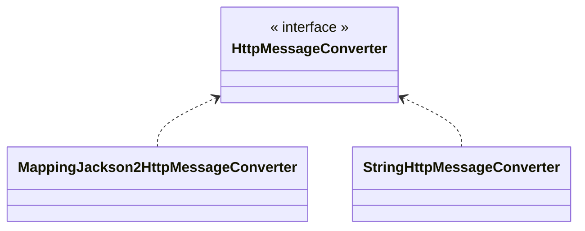

## HTTP 메세지 컨버터
HTTP API처럼 JSON 데이터를 HTTP 메세지 바디에 직접 읽거나 쓰는 경우 HTTP 메세지 컨버터를 사용하면 편리하다.

**HTTP 메시지 컨버터 적용 조건**
- `@ResponseBody`를 사용
	- HTTP의 Body에 문자 내용을 직접 반환
	- `viewResolver` 대신에 `HttpMessageConverter`가 동작
	- 기본 문자 처리는 `StringHttpMessageConverter`
	- 기본 객체 처리는 `MappingJackson2HttpMessageConverter`
	- byte 처리 등등 기타 여러 `HttpMessageConverter`가 기본으로 등록되어 있음

> [!tip] 참고
> 응답의 경우 클라이언트와 HTTP Accept 헤더, 서버의 컨트롤러 반환 타입 정ㅂ

---
References: 

Links to this page: 