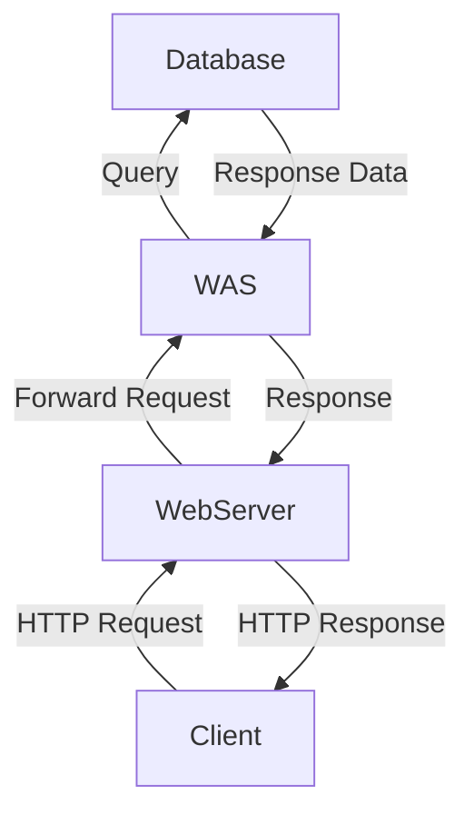

## 웹 서버와 웹 어플리케이션의 차이
> [[웹 서버]]와 [[웹 어플리케이션 서버]]에 대한 정의는 문서로 대체한다.

- 웹 서버는 정적 리소스(파일), WAS는 어플리케이션 로직
- 사실은 둘의 용어도 경계도 모호함
	- 웹 서버도 프로그램을 실행하는 기능을 포함하기도 함
	- 웹 어플리케이션 서버도 웹 서버의 기능을 제공함
- 자바는 서블릿 컨테이너 기능을 제공하면 WAS
	- 서블릿 없이 자바 코드를 실행하는 서버 프레임워크도 있다.
- WAS는 어플리케이션 코드를 실행하는데 더 특화

### 웹 시스템 구성 - WEB, WAS, DB

Bottom-Top 순서로 그린 아키텍쳐 다이어그램이다. 이런 구조에선 만약 `WAS`나 `DB`에서 장애가 발생하면 `WEB` 서버가 오류 화면 제공이 가능하다. 대부분 이런 구조를 많이 사용한다.

## 서블릿 (Servlet)

---
References: 김영한의 스프링 MVC 1편

Links to this page: 