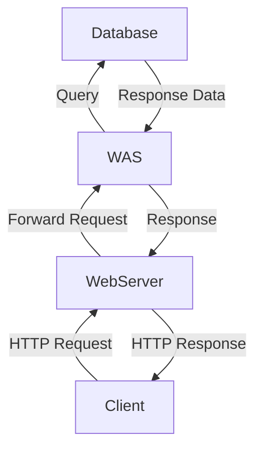
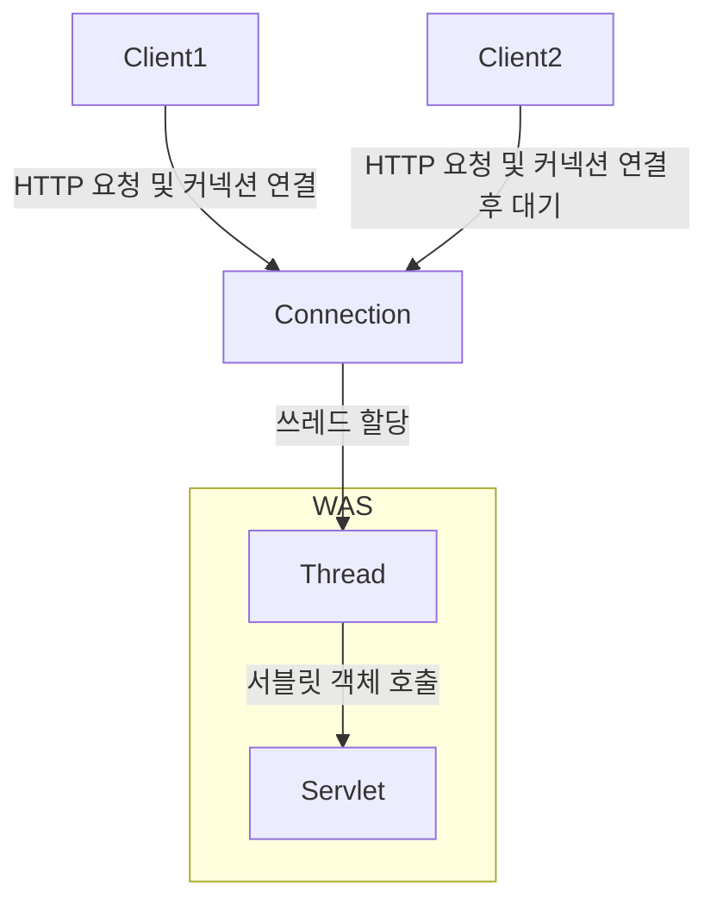

## 웹 서버와 웹 어플리케이션의 차이
> [[웹 서버]]와 [[웹 어플리케이션 서버]]에 대한 정의는 문서로 대체한다.

- 웹 서버는 정적 리소스(파일), WAS는 어플리케이션 로직
- 사실은 둘의 용어도 경계도 모호함
	- 웹 서버도 프로그램을 실행하는 기능을 포함하기도 함
	- 웹 어플리케이션 서버도 웹 서버의 기능을 제공함
- 자바는 서블릿 컨테이너 기능을 제공하면 WAS
	- 서블릿 없이 자바 코드를 실행하는 서버 프레임워크도 있다.
- WAS는 어플리케이션 코드를 실행하는데 더 특화

### 웹 시스템 구성 - WEB, WAS, DB


Bottom-Top 순서로 그린 아키텍쳐 다이어그램이다. 이런 구조에선 만약 `WAS`나 `DB`에서 장애가 발생하면 `WEB` 서버가 오류 화면 제공이 가능하다. 대부분 이런 구조를 많이 사용한다.

## 서블릿 (Servlet)
다음은 클라이언트(웹 브라우저)에서 요청한 HTTP 메시지다.

```http
POST /save HTTP/1.1
Host: localhost:8080
Content-Type: application/x-www-form-urlencoded

username=kim&age=20
```

만약 이 HTTP 요청을 직접 처리하는 웹 어플리케이션을 직접 구현하려면 다음과 같은 작업들이 필요하다. 이것들을 모두 구현해야 한다.

```text
서버 TCP/IP 연결 대기, 소켓 연결
HTTP 요청 메시지를 파싱해서 읽기
POST 방식, /save URL 인지
Content-Type 확인
HTTP 메세지 바디 내용 파싱
	username, age 데이터를 사용할 수 있게 파싱
저장 프로세스를 실행
비즈니스 로직 실행
	데이터베이스에 저장 요청
HTTP 응답 메시지 생성 시작
	HTTP 시작 라인 생성
	HTTP 헤더 생성
	메시지 바디에 HTML 생성에서 입력
TCP/IP에 응답 전달, 소켓 종료
```

과정만 살펴봐도 직접 구현하기 위해서는 어마무시한 수고가 들어갈 것이라는 것을 예상할 수 있다. 어떤 웹 서버를 만들더라도, `비즈니스 로직 실행` 부분을 제외하면 모두 HTTP 요청을 응답하기 위해 필수적인 기능들이다.

웹 서버들이 모두 공통적으로 처리해야하는 작업들을 대신하는 것이 서블릿이다. 

따라서 웹 개발자는 서블릿을 이용하면 비즈니스와 관계 없는 HTTP 요청 처리와 같은 복잡한 프로세스는 비중을 적게 두고, 비즈니스 로직을 좀 더 중점적으로 개발할 수 있게 된다.

```java title="서블렛의 예시"
@WebServlet(name = "helloServlet", urlPatterns = "/hello")
public class HelloServlet extends HttpServlet {
	@Override
	protected void service(HttpSevletRequest request, HttpServletResponse response) {
		...
	}
}
```
- urlPatterns(/hello)의 URL이 호출되면 서블릿 코드가 실행
- HTTP 요청 정보를 편리하게 사용할 수 있는 `HTTPServletRequest`
- HTTP 응답 정보를 편리하게 제공할 수 있는 `HttpServletResponse`
- 개발자는 HTTP 스펙을 매우 편리하게 사용


![[spring-mvc1-servlet-1.png]]

## 서블릿 컨테이너
- 톰캣처럼 서블릿을 지원하는 WAS를 서블릿 컨테이너라고 함
- 서블릿 컨테이너는 서블릿 객체를 생성, 초기화, 호출, 종료하는 생명주기 관리
- 서블릿 객체는 **싱글톤으로 관리** (스프링 컨테이너의 싱글톤 빈과 유사)
	- 최초 로딩 시점에 서블릿 객체를 미리 만들어두고 재활용 
	- 모든 고객 요청은 동일한 서블릿 객체 인스턴스에 접근
	- 서블릿 컨테이너 종료시 함께 종료
- JSP도 서블릿으로 변환 되어 사용
- 동시 요청을 위한 멀티쓰레드 처리 지원

## 동시 요청 - 멀티쓰레드
클라이언트가 서버에게 HTTP 요청을 보내게 되면, 커넥션 연결이 이루어져야 한다. 연결이 이루어지고 나면 "무언가"가 `Servlet` 객체를 호출해야 한다.

![[spring-mvc1-servlet-2.png]]

이 때 `Servlet` 객체를 호출하는 것이 쓰레드(Thread)다.

### 쓰레드 (Thread)
- 어플리케이션 코드를 하나하나 순차적으로 실행하는 것은 쓰레드
- 자바 메인 메서드를 처음 실행하면 `main`이라는 이름의 쓰레드가 실행
- 쓰레드가 없다면 자바 어플리케이션 실행 불가능
- 쓰레드는 한번에 하나의 코드 라인만 수행
- 동시 처리가 필요하면 쓰레드를 추가 생성

#### 단일 요청 - 쓰레드 하나 사용

![[spring-mvc1-thread-1.png]]

- 클라이언트 요청
	- 커넥션 연결
- 쓰레드 할당
	- 쓰레드가 서블릿 객체 호출
	- 서블릿 객체가 응답
- 응답 반환
- 쓰레드 휴식

#### 다중 요청 - 쓰레드 하나 사용

머메이드로 최대한 구조를 만들어보려고 했지만 만들기가 쉽지 않다. 어쨌든 위와 비슷한 구조로 이루어진다.

클라이언트 1이 요청을 보내고, 서블릿 객체에서 어떤 비즈니스 로직의 처리에 지연이 생겨서 처리가 늦어진다고 가정해본다.

그 사이에 클라이언트 2가 요청을 보내고 커넥션이 연결됐다. 그러나 단일 쓰레드는 현재 다른 업무를 처리중이다. 따라서 요청에 쓰레드가 할당되지 않는다. 쓰레드가 일을 끝낼 때 까지 기다려야 하

---
References: 김영한의 스프링 MVC 1편

Links to this page: 