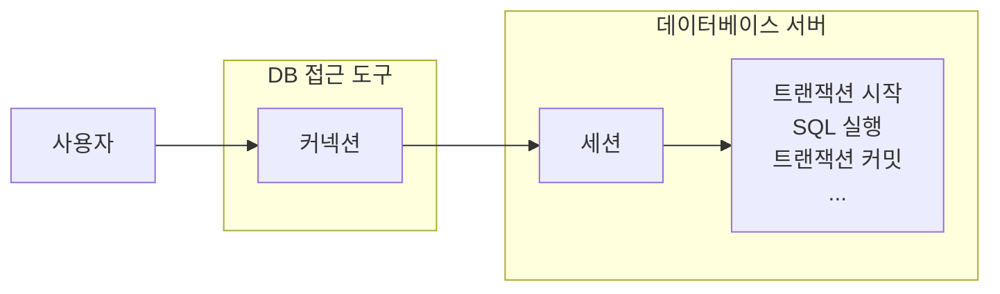
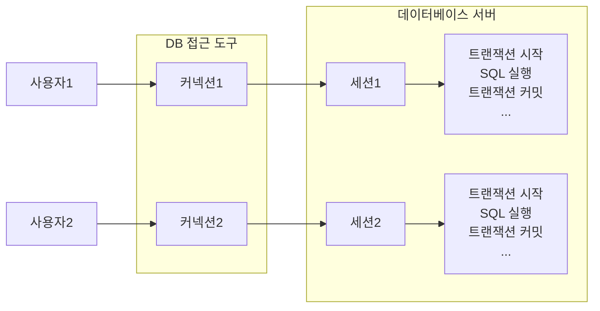

## 트랜잭션 개념 이해
사실 데이터를 저장할 때 단순히 파일에 저장해도 되는데, 데이터베이스에 저장하는 이유는 무엇일까? 이는 여러가지 이유가 있지만 가장 대표적인 이유는 바로 **데이터베이스는 트랜잭션이라는 개념을 지원**하기 때문이다.

트랜잭션을 이름 그대로 번역하면 거래라는 뜻이다. 이것을 쉽게 풀어서 이야기하면, 데이터베이스에서 트랜잭션은 하나의 거래를 안전하게 처리하도록 보장해주는 것을 뜻한다. 그런데 하나의 거래를 안전하게 처리하려면 생각보다 고려해야 할 점이 많다.

예를 들어서 A의 5000원을 B에게 계좌이체한다고 생각해보자. A의 잔고를 5000원 감소하고, B의 잔고를 5000원 증가해야한다.

**5000원 계좌이체 트랜잭션**
1. A의 잔고를 5000원 감소
2. B의 잔고를 5000원 증가

계좌이체라는 거래는 이렇게 두 가지 작업이 합쳐져서 하나의 작업처럼 동작해야 한다. 만약 1번은 성공했는데 2번에서 시스템에 문제가 발생하면 계좌 이체는 실패하고 A의 잔고만 5000원 감소하는 심각한 문제가 발생한다.

데이터베이스가 제공하는 트랜잭션 기능을 사용하면 1번과 2번 둘 다 함께 성공해야 저장하고, 중간에 하나라도 실패하면 거래 전의 상태로 되돌아갈 수 있다. 쉽게 말해 두 가지 작업 중 하나라도 실패하면, 실패하기 전의 상태로 완전히 되돌리는 것이다. 

결과적으로 2번 과정이 실패해도 A의 잔고가 감소하지 않는다.

모든 작업이 성공해서 데이터베이스에 정상 반영하는 것을 커밋(commit)이라고 하고, 작업 중 하나라도 실패해서 거래 이전으로 디돌리는 것을 롤백(rollback)이라 한다.

## 트랜잭션 ACID
트랜잭션은 ACID라 하는 네 가지 요소를 보장해야 한다. ACID를 이루는 네 가지 요소는 다음과 같다.

- 원자성(Atomicity): 트랜잭션 내에서 실행한 작업들은 마치 하나의 작업인 것처럼 모두 성공하거나 모두 실패해야 한다.
- 일관성(Consistency): 모든 트랜잭션은 일관성 있는 데이터베이스 상태를 유지해야 한다. 예를 들어 데이터베이스에서 정한 무결성 제약 조건을 항상 만족해야 한다.
- 격리성(Isolation): 동시에 실행되는 트랜잭션들이 서로에게 영향을 미치지 않도록 격리한다. 예를 들어 동시에 같은 데이터를 수정하지 못하도록 해야 한다. 격리성은 동시성과 관련된 성능 이슈로 인해 트랜잭션 격리 수준(Isolation Level)을 선택할 수 있다.
- 지속성(Durability): 트랜잭션을 성공적으로 끝내면 그 결과가 항상 기록되어야 한다. 중간에 시스템에 문제가 발생해도 데이터베이스 로그 등을 사용해서 성공한 트랜잭션 내용을 복구해야 한다.

트랜잭션은 원자성, 일관성, 지속성을 보장한다. 

문제는 격리성인데 트랜잭션 간에 격리성을 완벽히 보장하려면 트랜잭션을 거의 순서대로 실행해야 한다. 이렇게 하면 동시 처리 성능이 매우 나빠진다. 이런 문제로 인해 ANSI 표준은 트랜잭션의 격리 수준을 4단계로 나누어 정의했다.

#### 트랜잭션 격리 수준 (Isolation Level)
- READ UNCOMMITED(커밋되지 않은 읽기)
- READ COMMITED(커밋된 읽기)
- REPEATABLE READ(반복 가능한 읽기)
- SERIALIZABLE(직렬화 가능)

데이터베이스 입장에서 단계가 높아질수록(`SERIALIZABLE`이 가장 높다) 성능이 느려진다고 보면 된다. 보통 `SERIALIZABLE` 수준까지 사용하면 너무 느려지기 때문에 보통은 `READ COMMITED`를 기본으로 사용한다.

> 참고: 강의에서는 일반적으로 많이 사용하는 `READ COMMITED` 트랜잭션 격리 수준을 기준으로 설명한다.
> 
> 트랜잭션 격리 수준은 데이터베이스 자체에 관한 부분이어서 강의의 내용을 넘어선다. 트랜잭션 격리 수준에 대한 더 자세한 내용은 각 데이터베이스 메뉴얼을 찾아보면 된다.

## 데이터베이스 연결 구조와 DB 세션
트랜잭션을 더 자세히 이해하기 위해서 데이터베이스 서버 연결 구조와 DB 세션에 대해 알아본다.

#### 데이터베이스 연결 구조와 세션



사용자는 웹 어플리케이션 서버(WAS)나 DB 접근 도구 같은 클라이언트를 사용해서 데이터베이스 서버에 접근할 수 있다. 클라이언트는 데이터베이스 서버에 연결을 요청하고 커넥션을 맺게 된다. 이때 데이터베이스 서버는 내부에 세션이라는 것을 만든다. 그리고 앞으로 해당 커넥션을 통한 모든 요청은 이 세션을 통해서 실행하게 된다.

- 쉽게 이야기해서 개발자가 클라이언트를 통해 SQL을 전달하면 현재 커넥션에 연결된 세션이 SQL을 실행한다.
- 세션은 트랜잭션을 시작하고, 커밋 또는 롤백을 통해 트랜잭션을 종료한다. 그리고 이후에 새로운 트랜잭션을 다시 시작할 수 있다.
- 사용자가 커넥션을 닫거나, 또는 데이터베이스 관리자(DBA)가 세션을 강제로 종료하면 세션은 종료된다.

다음과 같이 커넥션 풀이 여러 개의 커넥션을 생성하면, 세션도 여러 개 만들어지고 각 트랜잭션 또한 독립적인 것을 확인할 수 있다.



## 트랜잭션 DB 예제 1 - 개념 이해
트랜잭션 동작을 예제를 통해 확인해본다. 이번에는 먼저 트랜잭션 동작 개념의 전체 그림을 이해하는데 집중한다.

참고로 지금부터 설명하는 내용은 트랜잭션 개념의 이해를 돕기 위한 예시다. 구체적인 실제 구현 방식은 데이터베이스마다 다르다.

#### 트랜잭션 사용법
데이터 변경 쿼리를 실행하고 데이터베이스에 그 결과를 반영하려면 커밋 명령어인 `commit`을 호출하고, 결과를 반영하고 싶지 않으면 롤백 명령어인 `rollback`을 호출하면 된다.

커밋을 호출하기 전까지는 임시로 데이터를 저장하는 것이다. 따라서 해당 트랜잭션을 시작한 세션(사용자)에게만 변경 데이터가 보이고, 다른 세션(사용자)에게는 변경 데이터가 보이지 않는다.

등록, 수정, 삭제 모두 같은 원리로 동작한다. 앞으로는 등록, 수정, 삭제라는 행위를 **변경**이라는 단어로 통틀어 표현한다.

**기본 데이터 조회**

![[transaction-1.png]]

- 세션1, 세션 2 둘 다 가운데 있는 기본 테이블을 조회하면 해당 데이터가 그대로 조회된다.

**세션1에서 신규 데이터 추가**

![[transaction-2.png]]
세션1은 트랜잭션을 시작하고 `신규회원1`, `신규회원2`를 데이터베이스에 추가했다. 아직 커밋은 하지 않은 상태다. 커밋하지 않았기에 추가된 데이터는 임시 상태로 저장된다.

- 세션1은 `SELECT` 쿼리를 실행해서 본인이 입력한 `신규회원1`, `신규회원2`를 조회할 수 있다.
- 세션2는 `SELECT` 쿼리를 실행해도 신규 회원들을 조회할 수 없다. 왜냐하면 세션1이 아직 커밋하지 않았기 때문이다.

**커밋하지 않은 데이터를 다른 곳에서 조회할 수 있으면 발생하는 문제**

1. 커밋하지 않은 데이터가 보인다면, 세션2는 데이터를 조회했을 때 `신규회원1`, `신규회원2`가 보일 것이다. 따라서 `신규회원1`, `신규회원2`가 있다고 가정하고 어떤 로직을 수행할 수 있다. 그런데 세션1이 롤백을 수행하면 `신규회원1`, `신규회원2`의 데이터가 사라지게 된다. 따라서 데이터 정합성에 큰 문제가 발생한다.
2. 세션2에서 세션1이 아직 커밋하지 않은 변경 데이터가 보인다면, 세션1이 롤백 했을 때 심각한 문제가 발생할 수 있다. 따라서 커밋 전의 데이터는 다른 세션에서 보이지 않는다.

**세션1 신규데이터 추가 후 커밋**

![[transaction-3.png]]

세션1이 신규 데이터를 추가한 후에 `commit`을 호출했다. `commit`으로 인해 새로운 데이터가 실제 데이터베이스에 반영된다.

- 이제 다른 세션에서도 회원 테이블을 조회하면 신규 회원들을 확인할 수 있다.

**세션1 신규 데이터 추가 후 롤백**

![[transaction-4.png]]

세션1이 신규 데이터를 추가 한 후에 `rollback`을 호출했다. `rollback`의 결과로 세션1이 데이터베이스에 반영한 모든 데이터가 처음 상태로 복구된다.

- 수정하거나 삭제한 데이터도 `rollback`을 호출하면 모두 트랜잭션을 시작하기 직전의 상태로 복구된다.

## 트랜잭션 DB 예제 2 - 자동 커밋과 수동 커밋
이전에 설명한 예제를 코드로 작성하기 전에 먼저 **자동 커밋**과 **수동 커밋**에 대해 알아본다. 예제에 사용되는 스키마는 다음과 같다.

```sql
drop table member if exists;
	create table member (
	member_id varchar(10),
	money integer not null default 0,
	primary key (member_id)
);
```

#### 자동 커밋 설정
트랜잭션을 사용하려면 먼저 자동 커밋과 수동 커밋을 이해해야 한다. 자동 커밋으로 설정하면 각각의 쿼리 실행 직후에 자동으로 커밋을 호출한다. 따라서 커밋이나 롤백을 직접 호출하지 않아도 되는 편리함이 있다.

하지만 쿼리를 하나하나 실행할 때 마다 자동으로 커밋이 되어버리기 때문에 우리가 원하는 트랜잭션 기능을 제대로 사용할 수 없다.

```sql
SET autocommit true; //자동 커밋 모드 설정 (기본 값)

INSERT INTO member(member_id, money) VALUES ('data1', 10000);
INSERT INTO member(member_id, money) VALUES ('data2', 10000);
```

> [!note] 자동 커밋 모드의 트랜잭션 작동
> 
> 자동 커밋 모드같은 경우, 위와 같은 SQL 한 줄이 하나의 트랜잭션에 해당한다. 따라서 다음과 같은 과정을 모두 처리한다.
> - 트랜잭션을 시작
> - SQL 전달
> - 실행
> - 커밋
> - 트랜잭션 종료

#### 수동 커밋 설정
트랜잭션 기능(커밋과 롤백)을 제대로 수행하려면 다음과 같이 자동 커밋을 끄고 수동 커밋을 사용해야 한다.

```sql
SET autocommit false; //수동 커밋 모드 설정

INSERT INTO member(member_id, money) VALUES ('data3',10000);
INSERT INTO member(member_id, money) VALUES ('data4',10000);
commit; //수동 커밋
```

보통 자동 커밋 모드가 기본으로 설정된 경우가 많기 때문에, **수동 커밋 모드로 설정하는 것을 트랜잭션을 시작**한다고 표현할 수 있다. 수동 커밋 설정을 하면 이후에 꼭 `commit`, `rollback`을 호출해야 한다.

참고로 수동 커밋 모드나 자동 커밋 모드는 한번 설정하면 해당 세션에서는 계속 유지된다. 중간에 변경하는 것은 가능하다.

> [!note] 트랜잭션 타임아웃
> 수동 커밋 모드의 경우 트랜잭션이 끝나면 커밋이나 롤백을 반드시 실행해야 한다. 그런데 이 커밋이나 롤백을 하지 않으면 트랜잭션 타임아웃이 발생하는데 이 타임아웃 시간은 데이터베이스마다 다르다.
> 
> 트랜잭션 타임아웃이 발생하면 해당 트랜잭션은 자동으로 롤백된다.

## 트랜잭션 DB 예제 3 - 트랜잭션 실습
먼저 트랜잭션을 실습하고 직접 확인해보기 위해 H2 데이터베이스 콘솔을 두 개 사용한다. 주의할 점으로는 두 페이지의 쿼리 파라미터에 `jsessionId`가 서로 다르게 접속해야 한다는 점이다.

#### 데이터 초기화 SQL

![[transaction-1.png]]

위 구조의 테이블을 만들기 위해 먼저 다음 쿼리를 실행해서 멤버 테이블을 초기화한다.

```sql
set autocommit true;
delete from member;
insert into member(member_id, money) values ('oldId',10000);
```

#### 신규 데이터 추가 - 커밋 전

![[transaction-2.png]]

이제 세션1에서 다음 쿼리를 실행해서 트랜잭션을 시작한다.

```sql
//트랜잭션 시작
set autocommit false; //수동 커밋 모드
insert into member(member_id, money) values ('newId1',10000);
insert into member(member_id, money) values ('newId2',10000);
```

세션2에서 멤버 테이블을 조회하면 세션1에서 입력한 위 데이터들이 보이지 않는다.

#### 커밋

![[transaction-3.png]]

앞서 데이터를 추가했던 세션1에서 커밋을 호출한다.

```sql
commit;
```

세션2에서 멤버 테이블을 조회하면 앞서 세션1이 트랜잭션을 커밋했기 때문에 실제 데이터베이스에 반영 된 것을 확인할 수 있다. 따라서 모든 세션에서 데이터를 조회할 수 있다.

#### 롤백

![[transaction-1.png]]

예제를 처음으로 되돌리기 위해 데이터를 먼저 초기화한다.

```sql
//데이터 초기화
set autocommit true;
delete from member;
insert into member(member_id, money) values ('oldId',10000);
```

다음으로 세션1에서 트랜잭션을 시작 상태로 만든 다음, 데이터를 추가한다.

![[transaction-2.png]]


```sql
set autocommit false; //수동 커밋 모드
insert into member(member_id, money) values ('newId1',10000);
insert into member(member_id, money) values ('newId2',10000);
```

세션1에서 추가한 데이터가 커밋하지 않았기 때문에 아직 다른 세션에선 멤버 테이블을 조회해도 추가한 데이터를 볼 수 없다.

세션1에서 멤버 테이블을 조회하면 추가된 데이터가 정상적으로 출력된다. 이제 세션1에서 롤백을 호출한다.

```sql
rollback;
```

결과적으로 롤백으로 해당 데이터 삽입 트랜잭션이 DB에 반영되지 않은 것을 확인할 수 있다.

## 트랜잭션 DB 예제 4 - 계좌 이체
이번에는 계좌이체 예제를 통해 트랜잭션이 어떻게 사용되는지 조금 더 자세히 알아본다. 다음 3가지 상황을 준비했다.

- 계좌이체 정상
- 계좌이체 문제 상황 - 커밋
- 계좌이체 문제 상황 - 롤백


---
References: 김영한의 스프링 DB 1편

Links to this page: 