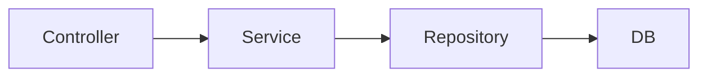

## 웹 어플리케이션의 계층 구조

여러가지 어플리케이션 구조가 있지만 가장 단순하면서 많이 사용하는 방법은 역할에 따라 3가지 계층으로 나누는 것이다.




#### 순수한 서비스 계층
여기서 가장 중요한 곳은 핵심 비즈니스 로직이 들어있는 서비스 계층이다.

시간이 흘러서 UI(웹)와 관련된 부분이 변하고, 데이터 저장 기술을 다른 기술로 변경해도, 비즈니스 로직은 최대한 변경없이 유지되어야 한다. 이렇게 하려면 서비스 계층을 특정 기술에 종속적이지 않게 개발해야 한다.

이렇게 계층을 나눈 이유도 서비스 계층을 최대한 순수하게 유지하기 위한 목적이 크다. 기술에 종송적인 부분은 프레젠테이션 계층, 데이터 접근 계층에서 가지고 간다.

**프레젠테이션 계층**
- UI와 관련된 처리 담당
- 웹 요청과 응답
- 사용자 요청 검증
- 주 사용 기술: 서블릿과 HTTP 같은 웹 기술, 스프링 MVC

프레젠테이션 계층은 클라이언트가 접근하는 UI와 관련된 기술인 웹, 서블릿, HTTP와 관련된 부분을 담당한다. 그래서 서비스 계층을 이런 UI와 관련된 기술로부터 보호해준다. 

예를 들어서 HTTP API를 사용하다가 GRPC 같은 기술로 변경해도 프레젠테이션 계층의 코드만 변경하고, 서비스 계층은 변경하지 않아도 된다.

**서비스 계층**
- 비즈니스 로직 담당
- 주 사용 기술: 가급적 특정 기술에 의존하지 않고, 순수 자바 코드로 작성


**데이터 접근 계층**
- 실제 데이터베이스에 접근하는 코드
- 주 사용 기술: JDBC, JPA, File, Redis, MongoDB..

데이터 접근 계층은 데이터를 저장하고 관리하는 기술을 담당한다. 그래서 JDBC, JPA와 같은 구체적인 데이터 접근 기술로부터 서비스 계층을 보호해준다. 

예를 들어서 JDBC를 사용하다가 JPA로 변경해도 서비스 계층은 변경하지 않아도 된다. 물론 서비스 계층에서 데이터 접근 계층을 직접 접근하는 것이 아니라, 인터페이스를 제공하고 서비스 계층은 이 인터페이스에 의존하는 것이 좋다. 

그래야 서비스 코드의 변경 없이 `JdbcRepository`를 `JpaRepository`로 변경할 수 있다.

이렇게 계층화를 통해 서비스 계층이 특정 기술에 종속되지 않기 때문에 비즈니스 로직을 유지보수 하기도 쉽고 테스트 하기도 쉬워진다.

> [!summary] 순수한 서비스 계층 정리
> 서비스 계층은 가급적 비즈니스 로직만 구현하고 특정 구현 기술에 직접 의존해서는 안된다. 이렇게 하면 향후 구현 기술이 변경될 때 변경의 영향 범위를 최소화 할 수 있다.

## 문제점들
서비스 계층을 순수하게 유지하려면 어떻게 해야할까? 지금까지 개발한 `MemberServiceV1` 코드를 살펴보자.

### MemberServiceV1

```java
@RequiredArgsConstructor  
public class MemberServiceV1 {  
    private final MemberRepositoryV1 memberRepository;  
  
    public void transfer(String fromId, String toId, int money) throws SQLException {  
        Member fromMember = memberRepository.findById(fromId);  
        Member toMember = memberRepository.findById(toId);  
  
        memberRepository.update(fromId, fromMember.getMoney() - money);  
        memberRepository.update(toId, toMember.getMoney() + money);  
    }  
}
```

이 `MemberServiceV1`은 특정 기술에 (거의) 종속되지 않고, 비즈니스 로직만 존재한다. 특정 기술과 관련된 코드가 거의 없어서 코드가 깔끔하고 유지보수 하기 쉽다.

향후 비즈니스 로직의 변경이 필요하면 이 부분을 변경하면 된다.

사실 여기에도 다음과 같은 남은 문제가 있다.
- `SQLException`이라는 `JDBC` 기술에 의존한다는 점이다.
- 이 부분은 `memberRepository`에서 던지는 예외이기 때문에 `memberRepository`에서 해결해야 한다.
- `MemberRepositoryV1`이라는 구체 클래스에 직접 의존하고 있다.

다음으로 트랜잭션을 적용한 `MemberServiceV2` 코드를 살펴본다.

### MemberServiceV2

```java
@Slf4j  
@RequiredArgsConstructor  
public class MemberServiceV2 {  
    private final MemberRepositoryV2 memberRepository;  
    private final DataSource dataSource;  
  
    public void transfer(String fromId, String toId, int money) throws SQLException {  
        Connection con = dataSource.getConnection();  
  
        try {  
            con.setAutoCommit(false);  
  
            bizLogic(con, fromId, toId, money);  
  
            con.commit();  
        } catch (Exception e) {  
            con.rollback();  
            throw new IllegalStateException(e);  
        } finally {  
            release(con);  
        }  
    }  
  
    private void bizLogic(Connection con, String fromId, String toId, int money) throws SQLException {  
        Member fromMember = memberRepository.findById(con, fromId);  
        Member toMember = memberRepository.findById(con, toId);  
  
        memberRepository.update(con, fromId, fromMember.getMoney() - money);  
        validation(toMember);  
        memberRepository.update(con, toId, toMember.getMoney() + money);  
    }  
  
    private static void release(Connection con) {  
        if (con != null) {  
            try {  
                con.setAutoCommit(true);  
                con.close();  
            } catch (Exception e) {  
                log.info("error", e);  
            }  
        }  
    }  
  
    private static void validation(Member toMember) {  
        if (toMember.getMemberId().equals("ex")) {  
            throw new IllegalStateException("이체 중 예외 발생");  
        }  
    }  
}
```

트랜잭션은 비즈니스 로직이 있는 서비스 계층에서 시작하는 것이 좋다. 

그런데 문제는 트랜잭션을 사용하기 위해서 `javax.sql.DataSource`, `java.sql.Connection`, `java.sql.SQLException` 같은 `JDBC` 기술에 의존해야 한다는 점이다.

트랜잭션을 사용하기 위해 `JDBC` 기술에 의존한다. 결과적으로 비즈니스 로직보다 `JDBC`를 사용해서 트랜잭션을 처리하는 코드가 더 많다. 향후 `JDBC`에서 `JPA` 같은 다른 기술로 바꾸어 사용하게 되면 서비스 코드도 모두 함께 변경해야 한다.

핵심 비즈니스 로직과 `JDBC` 기술이 섞여 있어서 유지보수 하기 어렵다.

---
References: 김영한의 스프링 DB 1편

Links to this page: 