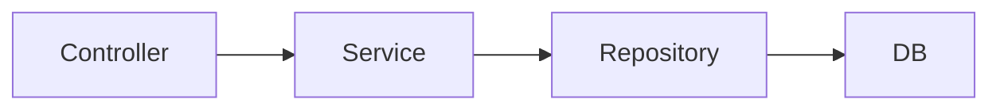

## 문제점들
여러가지 어플리케이션 구조가 있지만 가장 단순하면서 많이 사용하는 방법은 역할에 따라 3가지로 나누는 것이다.

**프레젠테이션 계층**
- UI와 관련된 처리 담당
- 웹 요청과 응답
- 사용자 요청 검증
- 주로 서블릿과 HTTP 같은 웹 기술, 스프링 MVC

**서비스 계층**
- 비즈니스 로직 담당
- 주 사용 기술: 가급적 특정 기술에 의존하지 않고, 순수 자바 코드로 작성

**데이터 접근 계층**
- 

---
References: 김영한의 스프링 DB 1편

Links to this page: 