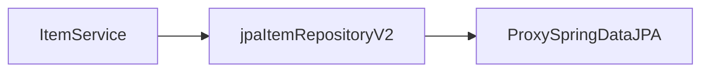
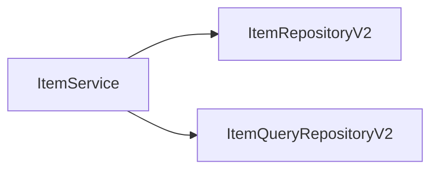

## 스프링 데이터 JPA 예제와 트레이드 오프

다시 [[6. 스프링 데이터 JPA]]를 되돌아보면, 다음과 같이 `jpaItemRepositoryV2`가 어댑터 역할을 해준 덕분에 `itemService`의 코드 변경 없이 구현체를 변경할 수 있었다.



- 문제는 이런 구조를 맞추기 위해서(서비스 레이어가 외부 의존성을 갖지  않기 위해서) 중간에 어댑터가 들어가면서 전체 구조가 복잡해지고, 사용하는 클래스도 많아지는 단점이 생겼다.
- 실제 이 코드를 구현해야 하는 개발자 입장에서 보면 중간에 어댑터도 만들고, 실제 코드까지 만들어야 하는 불편함이 생긴다.
- 유지보수적 관점에서 `ItemService`를 변경하지 않고 `ItemRepository`의 구현체를 변경할 수 있는 장점이 있다. 그러니까 DI, OCP 원칙을 지킬 수 있다는 좋은 점은 있지만 반대로 구조가 복잡해지면서 어댑터 코드와 실제 코드까지 함께 유지보수 해야 하는 어려움도 발생한다.

쉽게 말해서 다음과 같은 트레이드 오프가 존재한다.
- 어댑터 패턴을 활용해서 `itemService` 코드의 변경 없이 사용하지만, 어플리케이션 구조가 복잡해진다. (유지보수가 어려워짐)
- `itemService`가 직접적으로 `jpaItemRepositoryV2`를 의존하고 코드도 변경해야 하지만, 어플리케이션 구조가 단순해진다. (유지보수가 쉬워짐)

**어플리케이션 구조의 안정성 vs 단순한 구조와 개발의 편리성** 사이의 선택인 것이다. 이 둘 중에 어느 것 하나가 정답이라고 할 순 없지만 어설픈 추상화는 오히려 독이 되는 경우가 많다. 무엇보다 추상화도 비용이 든다.

여기서 말하는 비용이란 유지보수 관점에서의 비용을 뜻한다. 이 추상화 비용을 넘어설 만큼 효과가 있을 때 추상화를 도입하는 것이 실용적이다.

## 실용적인 구조
앞서 [[7. Querydsl]]를 사용한 리포지토리는 `스프링 데이터 JPA`를 사용하지 않고 `JPA`만 사용했다. 이번에는 `스프링 데이터 JPA`의 기능은 최대한 살리면서 `Querydsl`도 편리하게 사용할 수 있는 다음과 같은 구조로 만들어본다.


- `ItemRepositoryV2`는 스프링 데이터 JPA의 기능을 제공하는 리포지토리다.
- `ItemQueryRepositoryV2`는 `Querydsl`을 사용해서 복잡한 쿼리 기능을 제공하는 리포지토리이다.

이렇게 둘을 분리하면 기본 CRUD와 단순 조회는 스프링 데이터 JPA가 담당하고, 복잡한 조회 쿼리는 `Querydsl`이 담당하게 된다. 물론 `ItemService`는 기존 `ItemRepository`를 사용할 수 없기 때문에 코드를 변경해야 한다.

```java title="ItemQueryRepositoryV2.java"
@Repository  
public class ItemQueryRepositoryV2 {  
    private final JPAQueryFactory query;  
  
    public ItemQueryRepositoryV2(EntityManager em) {  
        this.query = new JPAQueryFactory(em);  
    }  
  
    public List<Item> findAll(ItemSearchCond cond) {  
        return query.select(item)  
                .from(item)  
                .where(  
                        likeItemName(cond.getItemName()),  
                        maxPrice(cond.getMaxPrice()))  
                .fetch();  
    }  
  
    private BooleanExpression likeItemName(String itemName) {  
        if (StringUtils.hasText(itemName)) {  
            return item.itemName.like("%" + itemName + "%");  
        }  
        return null;  
    }  
  
    private BooleanExpression maxPrice(Integer maxPrice) {  
        if (maxPrice != null) {  
            return item.price.loe(maxPrice);  
        }  
        return null;  
    }  
  
}
```

- `ItemQueryRepositoryV2`는 복잡한 쿼리를 수행하는 리포지토리이다. `Querydsl`을 사용하기 위해서 생성자에서 `EntityManager`를 주입 받아 `JPAQueryFactory`를 생성한다.

```java title="ItemRepositoryV2.java"
public interface ItemRepositoryV2 extends JpaRepository<Item, Long> {  
}
```

- `ItemRepositoryV2`는 스프링 데이터 JPA를 이용해서 간단히 구현할 수 있다.

```java title="ItemServiceV2.java"
@Service  
@RequiredArgsConstructor  
@Transactional  
public class ItemServiceV2 implements ItemService {  
    private final ItemRepositoryV2 itemRepositoryV2;  
    private final ItemQueryRepositoryV2 itemQueryRepositoryV2;  
  
    @Override  
    public Item save(Item item) {  
        return itemRepositoryV2.save(item);  
    }  
  
    @Override  
    public void update(Long itemId, ItemUpdateDto updateParam) {  
        Item item = itemRepositoryV2.findById(itemId).orElseThrow();  
        item.setItemName(updateParam.getItemName());  
        item.setPrice(updateParam.getPrice());  
        item.setQuantity(updateParam.getQuantity());  
    }  
  
    @Override  
    public Optional<Item> findById(Long id) {  
        return itemRepositoryV2.findById(id);  
    }  
  
    @Override  
    public List<Item> findItems(ItemSearchCond itemSearch) {  
        return itemQueryRepositoryV2.findAll(itemSearch);  
    }  
}
```

- `ItemServiceV2`는 `ItemService`를 구현하는데, 서비스 내부에서는 앞서 구현한 두 리포지토리를 의존한다.
- 복잡한 쿼리는 `ItemQueryRepositoryV2`를 사용하고, 단순한 쿼리는 스프링 데이터 JPA가 제공하는 기능을 사용하면 된다.


---
References: 김영한의 스프링 DB 2편

Links to this page: [[6. 스프링 데이터 JPA]]