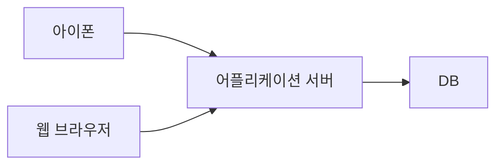
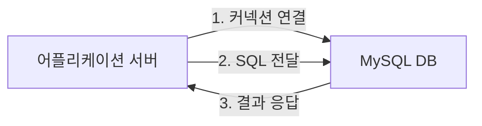
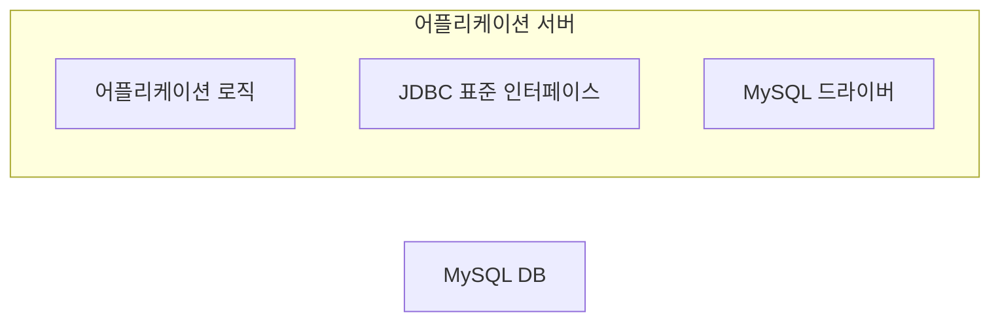

## 어플리케이션과 데이터베이스 기본 통신 구조

어플리케이션을 개발 할 때 중요한 데이터는 대부분 데이터베이스에 보관한다. 

클라이언트가 어플리케이션 서버를 통해 데이터를 저장하거나 조회하면, 어플리케이션 서버는 다음 과정을 통해서 데이터베이스를 사용한다.

1. 커넥션 연결: 주로 TCP/IP를 사용해서 커넥션을 연결한다.
3. SQL 전달: 어플리케이션 서버는 DB가 이해할 수 있는 SQL을 연결된 커넥션을 통해 DB에 전달한다.
3. 결과 응답: DB는 전달된 SQL을 수행하고 그 결과를 응답한다. 어플리케이션 서버는 응답 결과를 활용한다.

## JDBC 등장 이유
먼저 과거로 돌아가서 JDBC는 왜 등장했는지부터 알아본다. 그러기 위해서는 다음과 같은 문제를 알아야 한다.

`다양한 데이터베이스가 있는데, 각각의 데이터베이스마다 커넥션을 연결하는 방법, SQL을 전달하는 방법, 그리고 결과를 응답 받는 방법이 모두 다르다는 점이다.`

여기에는 2가지 큰 문제가 있다.
1. 데이터베이스를 다른 종류의 데이터베이스로 변경하면 어플리케이션 서버에 개발된 데이터베이스 사용 코드도 함께 변경해야 한다.
2. 개발자가 각각의 데이터베이스마다 커넥션 연결, SQL 전달, 그리고 결과를 응답 받는 방법을 새롭게 학습해야 한다.

이 문제를 해결하기 위해 `JDBC`라는 자바 표준이 등장했다.

## JDBC 표준 인터페이스

> JDBC(Java Database Connectivity)는 자바에서 데이터베이스에 접속할 수 있도록 하는 자바 API다. JDBC는 데이터베이스에서 자료를 쿼리하거나 업데이트하는 방법을 제공한다.

![[jdbc-1.png]]

`JDBC`는 다음 3가지 기능을 표준 인터페이스로 정의해서 제공한다.
- `java.sql.Connection`: 커넥션 연결
- `java.sql.Statement`: SQL을 담은 내용
- `java.sql.ResultSet`: SQL 요청 응답

자바는 이렇게 표준 인터페이스를 정의해두었다. 이제부터 개발자는 이 표준 인터페이스만 사용해서 개발하면 된다.

그런데 인터페이스만 있다고 해서 기능이 동작하지는 않는다. 그렇다고 JDBC 인터페이스를 사용하고 싶은 개발자가 매번 직접 개발해봐야 다른 이들이 구현한 코드와 동작이 매번 달라진다.

따라서 이 `JDBC` 인터페이스를 가지고 각각의 DB 벤더(제공 회사)에서 자신의 DB에 맞도록 구현해서 라이브러리로 제공하는데 이것을 `JDBC 드라이버`라 한다.

예를 들어서 MySQL DB에 접근할 수 있는 것은 `MySQL JDBC 드라이버`라 하고, Oracle DB에 접근할 수 있는 것은 `Oracle JDBC 드라이버`라 한다.

쉽게 말해 `JDBC 드라이버`는 `JDBC` 인터페이스의 구현체다.

---
References: 김영한의 스프링 DB 1편

Links to this page: 