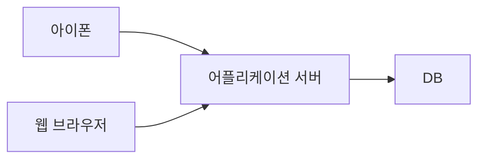
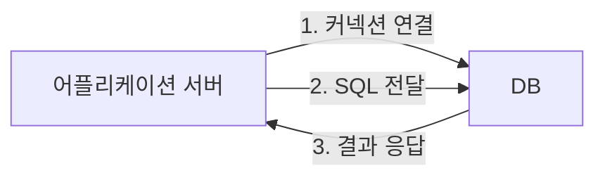

## JBDC 등장 이유
먼저 과거로 돌아가서 JDBC라는 기술이 왜 등장했는지 알아본다.

어플리케이션을 개발 할 때 중요한 데이터는 대부분 데이터베이스에 보관한다. 



클라이언트가 어플리케이션 서버를 통해 데이터를 저장하거나 조회하면, 어플리케이션 서버는 다음 과정을 통해서 데이터베이스를 사용한다.


1. 커넥션 연결: 주로 TCP/IP를 사용해서 커넥션을 연결한다.
3. SQL 전달: 어플리케이션 서버는 DB가 이해할 수 있는 SQL을 연결된 커넥션을 통해 DB에 전달한다.
3. 결과 응답: DB는 전달된 SQL을 수행하고 그 결과를 응답한다. 어플리케이션 서버는 응답 결과를 활용한다.

### 어플리케이션 서버와 DB 변경
```merma
```


---
References: 김영한의 스프링 DB 1편

Links to this page: 