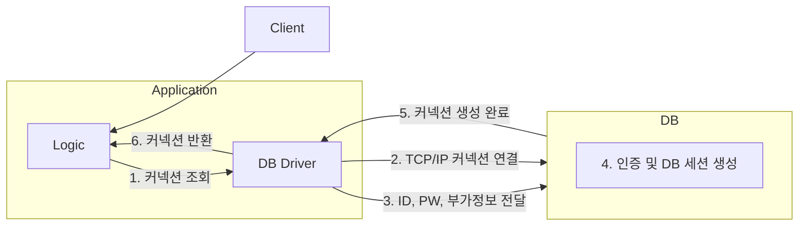

## 커넥션 풀 이해

```mermaid
graph RL
Client
subgraph Application
	Logic
	Driver[DB Driver]
end

subgraph DB
	Auth[4. 인증 및 DB 세션 생성]
end

Client --> Logic
Logic -->|1. 커넥션 조회| Driver
Driver -->|2. TCP/IP 커넥션 연결| DB
Driver -->|3. ID, PW, 부가정보 전달| DB
DB -->|5. 커넥션 생성 완료| Driver
Driver -->|6. 커넥션 반환| Logic

```

---
References: 

Links to this page: 