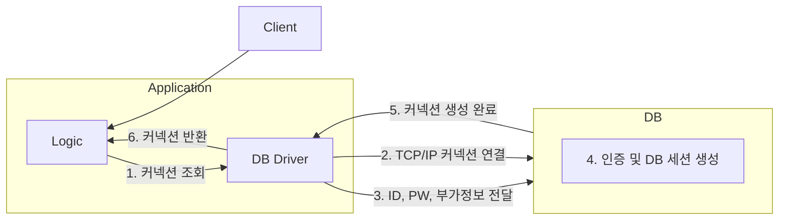

## 커넥션 풀 이해

앞서 [[1. JDBC 이해]]에서는 `JDBC`가 제공하는 `DriverManager`를 통해서 요청마다 매번 커넥션을 획득 했었다.

이 커넥션 획득 과정은 다음과 같다.

1. 어플리케이션 로직은 DB 드라이버를 통해 커넥션을 조회한다.
2. DB 드라이버는 DB와 `TCP/IP` 커넥션을 연결한다. 이 과정에서 `3 way handshake`같은 `TCP/IP` 연결을 위한 네트워크 동작이 발생한다.
3. DB 드라이버는 `TCP/IP` 커넥션이 연결되면 ID, PW와 기타 부가정보를 DB에 전달한다.
4. DB는 ID, PW를 통해 내부 인증을 완료하고 내부에 DB 세션을 생성한다.
5. DB는 커넥션 생성이 완료되었다는 응답을 보낸다.
6. DB 드라이버는 커넥션 객체를 생성해서 클라이언트에 반환한다.

이렇게 커넥션을 새로 만드는 일은 과정도 복잡하고 시간도 많이 소모 되는 일이다. DB는 물론이고 어플리케이션 서버에서도 `TCP/IP` 커넥션을 새로 생성하기 위한 리소스를 매번 사용해야 한다.

진짜 문제는 고객이 어플리케이션을 사용할 때 SQL을 실행하는 시간 뿐만 아니라 커넥션을 새로 만드는 시간이 추가되기 때문에 결과적으로 응답 속도에 영향을 준다.

> 데이터베이스마다 커넥션을 생성하는 시간은 조금씩 다르다. 시스템 상황마다 다르지만 MySQL 계열은 수 ms(밀리초) 정도로 매우 빨리 커넥션을 확보할 수 있다. 반면에 

---
References: 김영한의 스프링 DB 1편

Links to this page: [[1. JDBC 이해]]