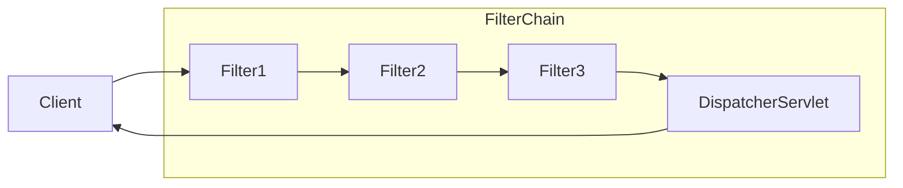

## 스프링 시큐리티 기본 아키텍쳐
서블릿을 지원하는 스프링 시큐리티 프레임워크는 [[8. 로그인 처리 2 - 필터와 인터셉터#서블릿 필터|서블릿 필터]]를 기반으로 동작한다. 따라서 서블릿 필터에 대한 기본적인 이해가 필요하다.

클라이언트가 어플리케이션에 요청을 보내면 컨테이너는 요청 URI의 경로에 따라 `HttpServletRequest`를 처리해야 하는 필터 인스턴스와 서블릿을 포함하는 `FilterChain`을 생성한다.

스프링 MVC 어플리케이션에서 서블릿은 `DispatcherServlet`의 인스턴스이다. 그리고 하나의 서블릿은 최대 하나의 `HttpServletRequest`와 `HttpServletResponse`를 처리할 수 있다. 그리고 둘 이상의 필터를 연결하고, 순서를 가지게 만들 수 있다.

쉽게 말해서 다음과 같은 흐름을 가진다.

- 클라이언트가 요청 전송
- 요청 핸들러 매핑(위 다이어그램에선 생략)
- 핸들러에 따라 필터 인스턴스와 서블릿이 포함된 `FilterChain`을 생성
- `Filter`가 요청을 필터링
- 필터링이 끝나면 다음 필터 호출
- 최종적으로 컨트롤러 호출

## FilterChainProxy
![[filter-chain-proxy.png]]
그림과 같이 스프링 시큐리티는 프록시 패턴을 사용하여 `DelegatingFilterProxy`를 서블릿 필터 체인에 등록한다.

그리고 `DelegatingFilterProxy`는 내부에 `FilterChainProxy`를 가지고 있다. 이 `FilterChainProxy`는 스프링 빈이기 때문에 일반적으로 `DelegatingFilterProxy`로 래핑된다.

큰 그림으로 단순히 생각해보면 서블릿 필터의 `doFilter()`를 통해 서블릿 필터 흐름 내에 사용하는 요청을 내부적으로 처리할 수 있도록 래핑되어 있는 것이다.

`FilterChainProxy`는 내부적으로 서블릿 필터 개념과 동일한 `SecurityFilterChain`을 가진다. 이 필터 체인 내부의 필터들은 일반적으로 스프링 빈이지만 `DelegatingFilterProxy`가 아닌 `FilterChainProxy`에 등록하는데 그 이유는 다음과 같다.

1. 스프링 시큐리티의 서블릿 지원을 위한 시작점(프론트 컨트롤러 패턴과 유사)을 제공한다.
2. `FilterChainProxy`는 스프링 시큐리티 사용의 핵심이므로 선택 사항으로 간주되지 않는 공통 작업을 수행한다(예: 메모리 누수 방지를 위한 `SecurityContext` 제거)
3. 특정 유형의 공격으로부터 어플리케이션을 보호하기 위해 스프링 시큐리티의 `HttpFirewall` 적용
4. 서블릿 필터와 동일하게, `SecurityFilterChain`이 언제 호출되어야 하는지 사용자가 지정할 수 있음

서블릿 컨테이너에서 필터 인스턴스는 URL 매칭을 기반으로 호출된다. 그러나 `FilterChainProxy`는 `RequestMatcher` 인터페이스를 사용해서 `HttpServletRequest` 스펙을 모두 활용해서 호출을 결정할 수 있다.

---
References: [스프링 공식 문서 - 스프링 시큐리티 아키텍쳐](https://docs.spring.io/spring-security/reference/servlet/architecture.html)

Links to this page: [[8. 로그인 처리 2 - 필터와 인터셉터#서블릿 필터]]