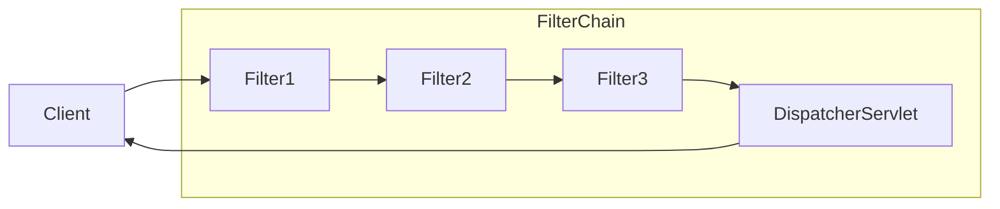

## 스프링 시큐리티 기본 아키텍쳐
서블릿을 지원하는 스프링 시큐리티 프레임워크는 [[8. 로그인 처리 2 - 필터와 인터셉터#서블릿 필터|서블릿 필터]]를 기반으로 동작한다. 따라서 서블릿 필터에 대한 기본적인 이해가 필요하다.

클라이언트가 어플리케이션에 요청을 보내면 컨테이너는 요청 URI의 경로에 따라 `HttpServletRequest`를 처리해야 하는 필터 인스턴스와 서블릿을 포함하는 `FilterChain`을 생성한다.

스프링 MVC 어플리케이션에서 서블릿은 `DispatcherServlet`의 인스턴스이다. 그리고 하나의 서블릿은 최대 하나의 `HttpServletRequest`와 `HttpServletResponse`를 처리할 수 있다. 그리고 둘 이상의 필터를 연결하고, 순서를 가지게 만들 수 있다.

쉽게 말해서 다음과 같은 흐름을 가진다.

- 클라이언트가 요청 전송
- 요청 핸들러 매핑(위 다이어그램에선 생략)
- 핸들러에 따라 필터 인스턴스와 서블릿이 포함된 `FilterChain`을 생성
- `Filter`가 요청을 필터링
- 필터링이 끝나면 다음 필터 호출
- 최종적으로 컨트롤러 호출

## FilterChainProxy
![[filter-chain-proxy.png]]
그림과 같이 스프링 시큐리티는 프록시 패턴을 사용하여 `DelegatingFilterProxy`를 필터 체인에 등록한다.

그리고 `DelegatingFilterProxy`는 내부에 `FilterChainProxy`를 가지고 있다. 이 `FilterChainProxy`는 스프링 빈이기 때문에 일반적으로 `DelegatingFilterProxy`로 래핑된다.

큰 그림으로 단순히 생각해보면 서블릿 필터의 `doFilter()`를 통해 서블릿 필터 흐름 내에 사용하는 요청을 내부적으로 처리할 수 있도록 래핑되어 있는 것이다.

`FilterChainProxy`는 내부적으로 `SecurityFilterChain`을 가진다. 이 필터들은 일반적으로 스프링 빈이지만 `DelegatingFilterProxy`가 아닌 `FilterChainProxy`에 등록된다.

`FilterChainProxy`에 등록되면 

SecurityFilterChain의 보안 필터는 일반적으로 Bean이지만, DelegatingFilterProxy가 아닌 FilterChainProxy에 등록됩니다. FilterChainProxy는 Servlet 컨테이너 또는 DelegatingFilterProxy에 직접 등록할 때 여러 가지 이점을 제공합니다. 

첫째, Spring Security의 모든 서블릿 지원을 위한 시작점을 제공합니다. 따라서 Spring Security의 서블릿 지원 문제를 해결하려는 경우 FilterChainProxy에 디버그 지점을 추가하는 것이 좋은 시작점입니다. 둘째, FilterChainProxy는 Spring Security 사용의 핵심이므로 선택 사항으로 간주되지 않는 작업을 수행할 수 있습니다. 예를 들어, 메모리 누수를 방지하기 위해 SecurityContext를 지웁니다. 또한 특정 유형의 공격으로부터 애플리케이션을 보호하기 위해 Spring Security의 HttpFirewall을 적용합니다. 또한 SecurityFilterChain이 언제 호출되어야 하는지를 보다 유연하게 결정할 수 있습니다. 서블릿 컨테이너에서 필터 인스턴스는 URL만을 기반으로 호출됩니다. 그러나 FilterChainProxy는 RequestMatcher 인터페이스를 사용하여 HttpServletRequest의 모든 것을 기반으로 호출을 결정할 수 있습니다.

---
References: [스프링 공식 문서 - 스프링 시큐리티 아키텍쳐](https://docs.spring.io/spring-security/reference/servlet/architecture.html)

Links to this page: [[8. 로그인 처리 2 - 필터와 인터셉터#서블릿 필터]]