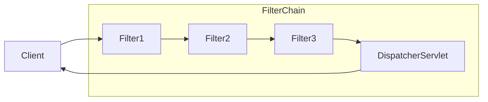

## 스프링 시큐리티 기본 아키텍쳐
서블릿을 지원하는 스프링 시큐리티 프레임워크는 [[8. 로그인 처리 2 - 필터와 인터셉터#서블릿 필터|서블릿 필터]]를 기반으로 동작한다. 따라서 서블릿 필터에 대한 기본적인 이해가 필요하다.

클라이언트가 어플리케이션에 요청을 보내면 컨테이너는 요청 URI의 경로에 따라 `HttpServletRequest`를 처리해야 하는 필터 인스턴스와 서블릿을 포함하는 `FilterChain`을 생성한다.

스프링 MVC 어플리케이션에서 서블릿은 `DispatcherServlet`의 인스턴스이다. 그리고 하나의 서블릿은 최대 하나의 `HttpServletRequest`와 `HttpServletResponse`를 처리할 수 있다. 그리고 둘 이상의 필터를 연결하고, 순서를 가지게 만들 수 있다.

쉽게 말해서 다음과 같은 흐름을 가진다.

- 클라이언트가 요청 전송
- 요청 핸들러 매핑(위 다이어그램에선 생략)
- 핸들러에 따라 필터 인스턴스와 서블릿이 포함된 `FilterChain`을 생성
- `Filter`가 요청을 필터링
- 필터링이 끝나면 다음 필터 호출
- 최종적으로 컨트롤러 호출

## FilterChainProxy
스프링 시큐리티는 프록시 패턴을 사용하여
`SecurityFilterChain`을 통해 여러 필터 인스턴스에 위임할 수 있습니다. FilterChainProxy는 Bean이기 때문에 일반적으로 DelegatingFilterProxy로 래핑됩니다. 다음 이미지는 FilterChainProxy의 역할을 보여줍니다.

스프링 시큐리티는 `FilterChainProxy`라는 컨테이너에 담긴다. `FilterChainProxy`는 스프링 시큐리티에서 제공하는 특별한 필터이다.

`FilterChainProxy`는 프록시 패턴을 사용해서 필터로 등록되고 내부적으로 스프링 시큐리

---
References: [스프링 공식 문서 - 스프링 시큐리티 아키텍쳐](https://docs.spring.io/spring-security/reference/servlet/architecture.html)

Links to this page: [[8. 로그인 처리 2 - 필터와 인터셉터#서블릿 필터]]