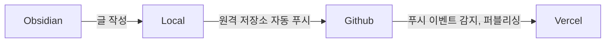

#### 제이의 지식정원에 오신걸 환영합니다.

깊이 있는 개발자가 되고 싶은 제이입니다.

이 웹사이트는 [quartz](https://quartz.jzhao.xyz)로 생성된 마크다운 기반의 정적 블로그입니다.

제가 사용하는 노트 앱인 [obsidian](https://obsidian.md)을 통해 기록하고 싶은 것들을 자동으로 퍼블리싱 하는 용도로 사용 됩니다. 이 블로그의 퍼블리싱 구조는 다음과 같습니다.

---
##### 저에 대해서

- 국내외 오버워치 프로게이머로 활동, 다음의 팀에서 활동함
	- [Conbox Gaming](https://liquipedia.net/overwatch/CONBOX)
	- [LA Gladiators](https://liquipedia.net/overwatch/Los_Angeles_Gladiators)
	- [Toronto Defiants](https://liquipedia.net/overwatch/Toronto_Defiant)
- 퍼블리셔 교육 수료 후 퍼블리셔로 입사
- 퍼블리셔에서 학습 후 Node.js 백엔드 개발자로 전환
- Node.js로 MVC 구조의 웹 어플리케이션 개발
- Selenium을 통한 웹 업무 자동화
- CentOS 환경에서의 배포 환경 구축 경험 및 쉘 스크립트를 통한 배포 자동화 (Node.js, Nginx, Shell Script)
- 사무 직군에서 파이썬을 통한 업무 자동화 경험

_모바일 환경에서는 탐색기를 지원하지 않으므로 하단에 위치한 공개 폴더 링크를 이용해주세요._
###### 링크
[Github](https://github.com/choiexe1)

###### 공개 폴더
- [[Resources/index|Resource]]

---

___블로그 내용 중 틀린 부분은 [메일 보내기](mailto:choiexe1@gmail.com)를 눌러 메일을 보내주시면 빠른 시일 내에 수정하도록 하겠습니다.___